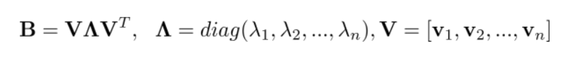

# Chapter 1. Dimensionality Reduction (Tutorial)


# Table of contents

- [Overview](#Overview)

- [Supervised Feature Selection](#Supervised-Feature-Selection)

  - [Genetic Algorithm](#Genetic-Algorithm)

- [Unsupervised Feature Extraction](#Unsupervised-Feature-Extraction)

  - [MDS](#MDS)
  - [ISOMAP](#ISOMAP)
  - LLE
  - t-SNE

  


# Overview

## 1) Problem

1) Tabular Data에도 물론 High-Dimensional Data가 있으나, 최근에 많이 사용되는 비정형 Data인 Image, Natural Language Data들은 대부분 아주 높은 데이터 차원을 가지고 있다. 차원이 높아지게 되면 차원의 저주(Curse of dimensionality)에 빠지게 되는데, 차원이 높아질수록 Machine Learning 알고리즘의 학습이 어려워지고(Noise Data가 증가 등), 연산량도 매우 높아지는 경향이 있다. 또한 고차원 데이터에서는 모델의 Generalization 성능을 높이기 위해서 더 많은 수의 Data가 일반적으로 더 필요하게 된다.

2) 또한 Visualize는 3차원 까지로만 할 수 있기 때문에, 데이터의 Understanding과 Expression을 위하여 고차원의 데이터를 1~3차원 까지로 표현해야 하는 경우가 존재한다.

   

## 2) Solution

이 두가지 문제(ML 알고리즘 성능의 문제 및 Visualization의 문제)를 해결하기 위해, 많은 연구원, 엔지니어들이 다양한 차원 감소 기법(Dimensionality Reduction)을 개발 해 왔다.

- 목적 : 모델에 Fitting에 가장 좋은 최고의 변수들의 subset을 찾는 것

- 고전적인 Dimensionality Reduction의 방법론 정리 (출처 : [고려대학교 산업경영공학부 강필성 교수님 Business Analytics 수업교재](https://www.dropbox.com/s/gehjerbhgwawhzs/01_1_Dimensionality%20Reduction_Overview%20and%20Variable%20Selection.pdf?dl=0))


- 최근에는 딥러닝 기반 Representation Learning, Embedding 등을 활용한 기법으로 Dimensionality Reduction을 많이 수행한다.


본 Tutorial에서는 고전적인 방법에서의 Dimensionality Reduction기법을 살펴보려 한다. 그리고 Feature Selection과 Extraction 관점에서 아래의 방법들을 Tutorial로 진행해 보도록 하겠다.


1. **Supervised** - Feature Selection
   - ❌Forward, Backward, Stepwise Selection
   - ✅Genetic Algorithm
2. **Unsupervised** - Feature Extraction
   1. ❌PCA
   2. ✅MDS (Multidimensional scaling)
   3. ✅LLE
   4. ✅ISOMAP
   5. ✅t-SNE


# Supervised (Feature Selection)


## Genetic Algorithm

### Notebook Tutorial

- [Go to the tutorial]() 
- [Reference Code](https://github.com/prakhargurawa/Feature-Selection-Using-Genetic-Algorithm) 


### About Feature Selection

- Dimensionality Reduction에는 간단하게 입력의 Feature들을 줄이는 기법들을 사용할 수 있다.
- 기본적으로 변수(Feature) Selection을 위해서는, 전역 탐색(like Grid Search)와 같은 방법이 가장 좋은 결과를 가져올 수 있으나 현실적으로 너무 느린 방법론이므로, 다양한 대체하는 방법론들이 개발되어져 왔다.

- 가장 간단히는 변수들을 저진선택하거나, 후진소거하거나, 단계적 선택을 하는 등의 탐색으로 속도를 빠르게 할 수 있으나, 알고리즘의 특성상 많은 조합의 최적 탐색값은 찾을 수 없다.

- 따라서 기존의 간단한 변수 Selection 방법을 넘어서서, Random성을 사용한 자연을 모방한 Meta-Heuristic방법인 Genetic Algorithm을 사용해 효율적이며 최적의 변수를 Selection하는 기법에 대한 Tutorial을 진행 해 보고자 한다.


### Genetic Algorithm Summary

- 생명체의 생식과정을 모사한 진화 알고리즘의 한 종류
- 기본적인 유전 알고리즘은 아래의 3가지 순서에 따라 구현된다.
  - Selection : 현재 가능 해집합에서 우수한 해들을 선택, 다음 세대를 생성하기 위한 부모 세대로 지정
  - Crossover : Selection에서 선택된 부모 세대들이 서로 유전자를 교환하여 새로운 세대 생성
  - Mutation : 낮은 확률로 유전자에 변이를 발생시켜, Random성을 통해 Local Optimum에서 빠져나올 수 있는 Chance를 제공
- Genetic Algorithm 도식도  (출처 : [고려대학교 산업경영공학부 강필성 교수님 Business Analytics 수업교재](https://www.dropbox.com/s/hnpfo9kmdovs3kp/01_2_Dimensionality%20Reduction_Genetic%20Algorithm.pdf))


### Step by Step


#### Step 0. Dataset 준비하기

이번에는 Genetic Algorithm의 각각의 Step을 하나씩 설명하며, Code로 구현을 해보도록 하겠다. 일단 Dataset은 Boston Dataset을 가져와서 사용하도록 하겠다. (Scikit-Learn에서는 이제 1.2버전부터 Boston Dataset을 가져오는 함수를 Deprecated할 예정이다. 윤리적 이슈라고 한다. Study목적으로만 사용해야 한다.)

```python
data_url = "http://lib.stat.cmu.edu/datasets/boston"
raw_df = pd.read_csv(data_url, sep="\s+", skiprows=22, header=None)
data = np.hstack([raw_df.values[::2, :], raw_df.values[1::2, :2]])
target = raw_df.values[1::2, 2]

x_train, x_test, y_train, y_test = train_test_split(data, target, random_state=4096)
```


#### Step 1. Initialization

전체 Feature에 대해서, Feature들은 Row열로 염색체(Chromosome)라는 Meta Information 정보드를 가질 수 있다. 이 Chromosome 전체는 Population이라고도 부르며, 그것의 개수(Size)은 Hyper-parameter이므로 적절히 잘 선택을 해줘야 한다.

그리고 각각의 염색체는 Binary Encoding(0과 1값)을 하여, 각 염색체별로 어떠한 Feature정보를 가져올지 선택 해 준다.

- 1 : Feature를 가져오기
- 0 : Feature를 가져오지 않기


*8개의 Chromosome으로 이루어진 Population 예시(출처 : [고려대학교 산업경영공학부 강필성 교수님 Business Analytics 수업교재](https://www.dropbox.com/s/hnpfo9kmdovs3kp/01_2_Dimensionality%20Reduction_Genetic%20Algorithm.pdf))*


해당을 Python 코드로 구현하면 아래와같다.

```python
# Step 1. Initialization
num_features = x_train.shape[1] 
num_population = 8 # hyper-parms for the number of population

def create_init_chromosome(num_features):
    chromosome_instance = [random.randrange(2) for _ in range(num_features)]
    return chromosome_instance


population = [create_init_chromosome(num_features) for _ in range(num_population)]
```


아래는 생성된 population에 대한 Output 예제이다. 8개의 Chromosome Row가 생성되었고, 해당 Feature들은 Random으로 1로 선택된 것을 볼 수 있다.


#### Step 2. Fitting Models

이제 선택된 Chromosome별로 예측 모델들을 학습한다. (예제의 Chromosome은 총 8개이므로, 8개의 모델을 생성하여 각 Chromosome별로 성능을 Test해야 한다.) 아래와 같이 Random함수를 통해 각 Feature별 0과 1로 선택할지 말지 여부가결정된 상태에서, Linear모델 등의 모델을 학습한다.


아래와 같은 Python Code로 간단히 Linear Model을 Fitting할 수 있다.

```python
chromosome_selected = [bool(chromo) for chromo in chromosome] 
x_train_selected = x_train[:, chromosome_selected]
X_test_selected = x_test[:, chromosome_selected]

linear_model.fit(x_train_selected, y_train)
```


#### Step 3. Model Evaluation

가장 좋은 성능(ex.  `R^2`)인 염색체를 찾기 위해 모델 적합도를 평가한다. 평가 Metric은 R-Square를 사용해도 되지만, MSE, MAE같은 Loss Function을 사용해도 된다. 아래와 같이 Fitting된 모델 각각의 Score를 구해서 모델을 평가하고, 평가된 Score를 저장해 둔다.

```python
# calculate chromosome scores
score = -99999

def calc_score(population):
    scores_chromosome = []
    for chromosome in population:
        if sum(chromosome) == 0: # Chromosome에 1이 하나도 없을 때
            score = -999999 
        else:
            chromosome_selected = [bool(chromo) for chromo in chromosome] 
            x_train_selected = x_train[:, chromosome_selected]
            X_test_selected = x_test[:, chromosome_selected]

            linear_model.fit(x_train_selected, y_train)
            score = linear_model.score(X_test_selected, y_test) 

        scores_chromosome.append(score)
    return scores_chromosome

scores_chromosome = calc_score(population)
```


#### Step 4. Selection

적합도가 높은 염색체들을 부모(Parents) 세대로 선택한다. (다음 세대를 위함). 해당 부모만 교배(Crossover) 및 돌연변이를 만들어 낼 수 있다. 

Deterministic하게 상위 X%만큼만 선택하거나, Probabilistic하게 Score의 %에 따라서 가중치에 따라 Random하게 선택도 가능하다.


하기 코드는 Deterministic하게 상위 50%만 선택하게 된다.

```python
# Step 4. Select Parent Chromosome
num_deterministic_selection = int(np.round(num_population * 0.5))

parent_chromosome_index = np.array(scores_chromosome).argsort()[-num_deterministic_selection:]
```


#### Step 5. Crossover & Mutation

유전자들을 교배 및 돌연변이 생성하여, 새로운 Population 생성한다.


##### 5-1) Crossover

선택된 부모 Chromosome들을 2개를 선택하여, 각각의 유전자 정보를 교환한다. (출처 : [고려대학교 산업경영공학부 강필성 교수님 Business Analytics 수업교재](https://www.dropbox.com/s/hnpfo9kmdovs3kp/01_2_Dimensionality%20Reduction_Genetic%20Algorithm.pdf))


Python Code로는 아래와 같이 구현을 한다. 50%만을 랜덤하게 Crossover하도록 구현하였다.

```python
# 현재의 선택된 Best Parenet 중에서 random으로 좋은 애들 2개를 선택함
select_2 = random.sample(list(range(len(candidate_parent_score))), 2)
winner_p1 = candidate_parent_chromosome[min(select_2, key=lambda idx: candidate_parent_score[idx])]

select_2 = random.sample(list(range(len(candidate_parent_score))), 2)
winner_p2 = candidate_parent_chromosome[min(select_2, key=lambda idx: candidate_parent_score[idx])]
        
# cross-over
c1 = []
c2 = []
	for i in range(len(winner_p1)):
		if random.random() < 0.5: # Random Crossover (50%)
			c1.append(winner_p1[i])
			c2.append(winner_p2[i])
		else:
			c1.append(winner_p2[i])
			c2.append(winner_p1[i])
```


##### 5-2) Mutation

Crossover로 생성된 새로운 Child Chromosome에 대하여 Random하게 값을 Flip한다.


아래의 예시는, 2개의 Child Chromosome에 대하여 Random하게 값을 Flip(0 ->1, 1 -> 0)함을 보여준다. (출처 : [고려대학교 산업경영공학부 강필성 교수님 Business Analytics 수업교재](https://www.dropbox.com/s/hnpfo9kmdovs3kp/01_2_Dimensionality%20Reduction_Genetic%20Algorithm.pdf))

Hyper-Parameter Threshold값에 의해서 Mutation을 일으키며, 아래는 0.01이 Threshold일 때의 예시이다.


코드로 구현하면 아래와 같으며, 20%의 확률로 Mutation을 일으키도록 하였다. (Threshold가 높을수록 Mutation을 많이하게되며, Global Optimum을 찾기위하여 더욱 많은 변형을 주게 된다.)

```python
# mutation
if random.random() <= 0.2:
	idx_mutation = random.randrange(0,len(c1))
	c1[idx_mutation] = 1 - c1[idx_mutation]
if random.random() <= 0.2:
	idx_mutation = random.randrange(0,len(c2))
	c2[idx_mutation] = 1 - c2[idx_mutation]    
```


#### Step 6. Final Generation

최적 변수 집합(최적 유전자) 선정을 수행한다. GA는 사용자가 정해준 Generation의 횟수에 따라 반복 계산된다. 

Step 2~5의 반복을 통하여 지속적으로 좋은 Chromosome조합을 찾아 Score가 가장 좋은 Feature들을 Selection 함


Best Chromosome은 최종적으로 아래와 같이 계산이 되고, Feature가 1로 선택이 된다.


아래 그림은 세대에 따라 Best Score값을 보여주며, 우측은 Population의 Score 표준편차가 얼마나 흔들리는지 보여줌(20%의 돌연변이 발생으로 표준편차가 많이 흔들리게 됨)


Best Chromosome은 Python Code로 아래와 같이 구현할 수 있다.

```python
best_index = np.argmax(candidate_parent_score)
best_score = candidate_parent_score[best_index]
best_parent_chromosome = candidate_parent_chromosome[best_index]
```


# Unsupervised Feature Extraction

Unsupervised Feature Extraction은 Selection과 달리 Label이 없는 상태에서, X값을 변환하여 차원을 축소하는 기법이다.


## MDS

MDS는 Multidimensional Scaling의 약자로써, PCA처럼 선형 차원축소 기법이다. 하지만 Distance Matrix만 있으면 진행할 수 있으므로, PCA보다 활용의 자유도가 높은 편이며, 향후 진행될 ISOMAP의 기본 로직이 되는 알고리즘이다.


### Notebook Tutorial

- [Go to the tutorial]() 
- [Reference Code](https://gist.github.com/Bollegala/24c5f6d9a5c9770c86f24316e8b170fd) 


#### Step 1. Distance Matrix 구하기

기본적으로 Raw Data (X Matrix)에서 Distance Matrix를 구한다. Distance Matrix는 다양한 수식을 사용할 수 있으며, Euclidean, Manhattan 거리라던지, Correlation등의 Similarity도 사용 가능하다.


아래 그림과 같이 d x n Matrix는 n x n Matrix로 변환하여 구한다. (출처 : [고려대학교 산업경영공학부 강필성 교수님 Business Analytics 수업교재](https://www.dropbox.com/s/hnpfo9kmdovs3kp/01_2_Dimensionality%20Reduction_Genetic%20Algorithm.pdf))


Python코드로 Distance Matrix를 구하면 아래와 같다. (Data는 3개 사용한다.)

```python
# 1. 3개의 Data를 정의합니다. 각각들의 Dimension은 알려져있지 않고, 단지 Similarity(or Distnace) Metric으로 거리가 계산된, Distance Matrix를 갖고 있습니다.
n = 3  
Y = numpy.array([[20, 18], [2, 13], [7, 24]], dtype=float)

D = numpy.zeros((n, n), dtype=float)

for i in range(0, n):
    for j in range(0, n):
        D[i, j] = numpy.linalg.norm(Y[i,:] - Y[j,:]) # L2-Nrom으로 정규화 합니다.

print("Distance Matrix D")
print(D)
```


#### Step 2. Distance Matrix를 사용해 B Matrix를 구한다.

Distance Matrix를 사용하여, 바로 Dimensionality Reduction된 좌표계로 변환은 힘들다. 따라서 B Matrix라는 중간 다리를 만들어서 최종 줄어든 좌표계로 변환을 진행한다.

B Matrix는 Distance Matrix D를 통해 아래의 수식으로 계산할 수 있다. (출처 : [고려대학교 산업경영공학부 강필성 교수님 Business Analytics 수업교재](https://www.dropbox.com/s/hnpfo9kmdovs3kp/01_2_Dimensionality%20Reduction_Genetic%20Algorithm.pdf))


Python Code로 구현하면 아래와 같다.

```python
def bval(D, r, s):
    n = D.shape[0]
    total_r = numpy.sum(D[:,s] ** 2)
    total_s = numpy.sum(D[r,:] ** 2)
    total = numpy.sum(D ** 2)
    val = (D[r,s] ** 2) - (float(total_r) / float(n)) - (float(total_s) / float(n)) + (float(total) / float(n * n))
    return -0.5 * val
```


#### Step 3. B Matrix에서 Eigen Value와 Eigen Vector를 구하고, 이를 통해 좌표를 변환한다.

좌표변환의 수식은 다음과 같다.  (출처 : [고려대학교 산업경영공학부 강필성 교수님 Business Analytics 수업교재](https://www.dropbox.com/s/hnpfo9kmdovs3kp/01_2_Dimensionality%20Reduction_Genetic%20Algorithm.pdf))


아래의 수식과 같이, B Matrix는 X와 X^T의 Inner Product로 구할 수 있고, 


이는 B는 symmetric, positive, semi-definite and of rank p이므로 다음과 같이 eigen value와 eigen vector로 표현 가능하다. (eigen-decomposition)



이를 통해 그 Half인 X를 구할 수 있으며, 최종적으로 변환된 X의 좌표는 아래와 같다.


이를 코드로 구현하면 아래와 같다.

```python
# 3. B에서 Eigen Vector와 Eigen Value를 구합니다.
a, V = numpy.linalg.eig(B)
idx = a.argsort()[::-1]
a = a[idx]
V = V[:,idx]
print("Eigen Values =", a)
print("Eigen vectors=", V)

A = numpy.diag(numpy.sqrt(a))
X = numpy.dot(V, A)

print("\nMatrix A")
print(A)

print("\nMatrix X")
print(X)
```


## ISOMAP

ISOMAP은 Isometric Feature Mapping의 약자이며, 비선형 차원축소 기법이다. 기본적으로 MDS를 Base로 하는데, Distance를 Nearest neighbor를 통하여 구하고, 이를 잇는 Shortest Path를 통해 Distance Matrix를 구한다. 그 구해진 Distance Matrix를 통해 MDS로 차원을 축소하게된다.

Step 1, 2를 통해 Distance(D) Matrix를 만들고 Step 3에서 MDS를 사용해 Dimensionality를 Reduction한다.


ISOMAP의 Concept을 도식화하면 아래와 같다. (출처 : [고려대학교 산업경영공학부 강필성 교수님 Business Analytics 수업교재](https://www.dropbox.com/s/hnpfo9kmdovs3kp/01_2_Dimensionality%20Reduction_Genetic%20Algorithm.pdf))


### Notebook Tutorial

- [Go to the tutorial]() 
- [Reference Code](https://github.com/lwileczek/isomap) 


#### Step 1 & 2. Neighborhood Graph 구조를 만들고, 동시에 Shortest Path로 Distance Matrix D를 구한다.

epsilon-Isomap을 수행하여, eps보다 작은 dist만을 adjacency matrix를 구해서 neighbor를 구한다.

그 외에 k-Isomap을 사용하면 k-nearest neighbor 함수를 사용할 수 있다.

Shortest Path 알고리즘은 Dijkstra부터 Floyd-Warshall, Bellman-Ford 등 다양한 기법을 사용하면 된다.


코드로 epsilon-Isomap을 구현하면 아래와 같다.

```python
# 1. Step 1&2 - epsilon-Neighborhood를 찾고 shortest-path 알고리즘으로 Distance Matrix를 만듬 
def make_adjacency(data, dist_func="euclidean", eps=1):
   """
   ISOMAP을 위한 epsilon-Neighborhood를 찾고 shortest-path 알고리즘으로 Distance Matrix를 만듬 
   Weighted Adjacency Matirx를 각 Point별로 찾는다. eps(epsiolon)안에 들어온 것들만 Neighbor로 취급한다. 

   Neighbor끼리의 거리 계산은 기본은 euclidean이지만, 아래와 같은 distance metric을 cdist가 지원한다.
    'braycurtis', 'canberra', 'chebyshev', 'cityblock', 'correlation',
    'cosine', 'dice', 'euclidean', 'hamming', 'jaccard', 'jensenshannon',
    'kulczynski1', 'mahalanobis', 'matching', 'minkowski',
    'rogerstanimoto', 'russellrao', 'seuclidean', 'sokalmichener',
    'sokalsneath', 'sqeuclidean', 'yule'.

    INPUT
      data - (ndarray) the dataset which should be a numpy array
      dist_func - (str) the distance metric to use. See SciPy cdist for list of
                  options
      eps - (int/float) epsilon value to define the local region. I.e. two points
                        are connected if they are within epsilon of each other.

    OUTPUT
      short - (ndarray) Distance matrix, the shortest path from every point to
          every other point in the set, INF if not reachable. 
   """
   n, m = data.shape
   dist = cdist(data.T, data.T, metric=dist_func)
   adj =  np.zeros((m, m)) + np.inf
   bln = dist < eps
   adj[bln] = dist[bln]
   short = shortest_path(adj)

   return short
```


#### Step 2. Shortest Path를 구해서 D를 만든다. (like Dijkstra, Floyd-Warshall, Bellman-Ford 등 사용 가능)

#### Step 3. MDS를 수행하여 Embedding을 수행한다.


## LLE

## t-SNE

