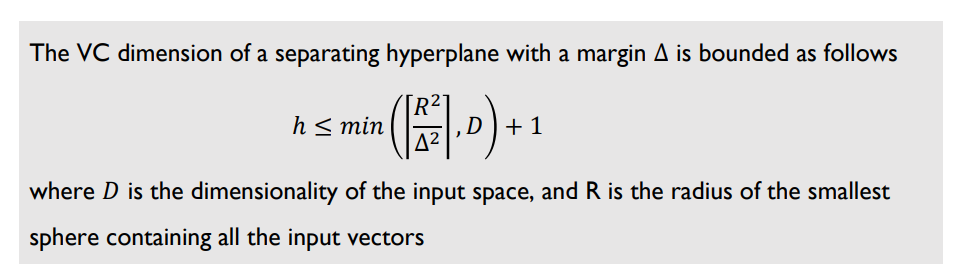
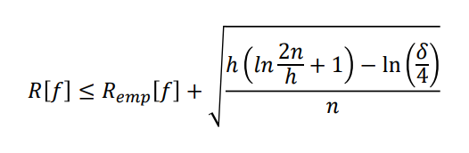
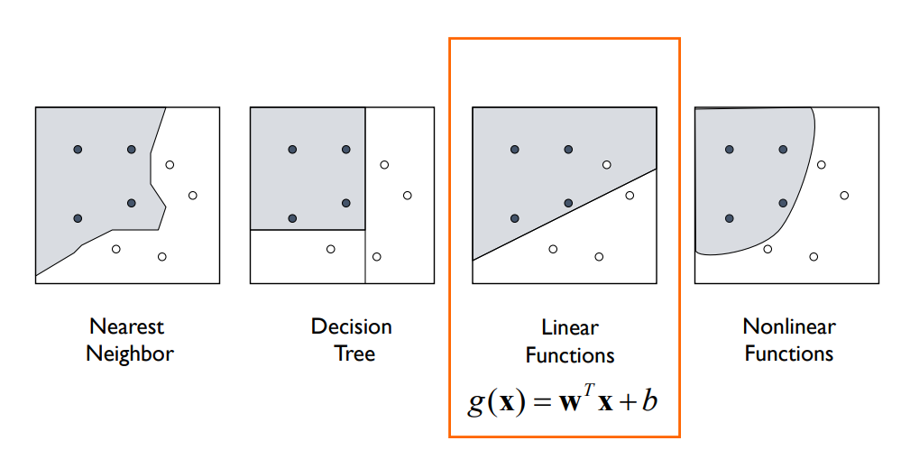
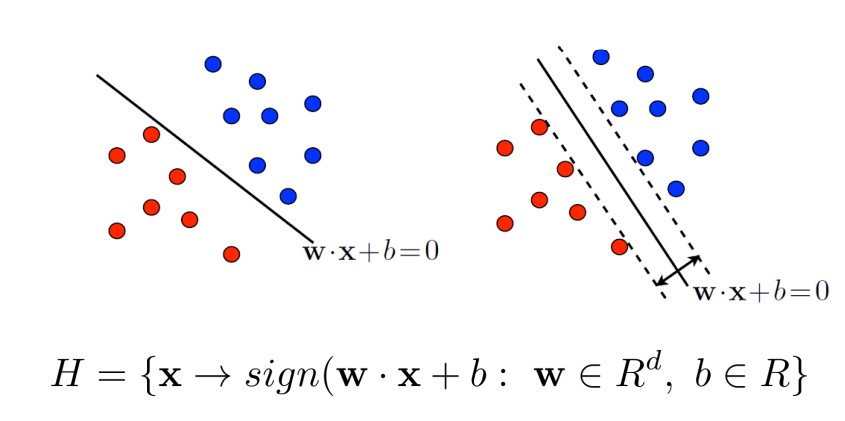

# 1. Basic Concept

## Basic Concept of Shatter
- Shatter란, 함수 F는 n개의 points를 shatter할 수 있다는 개념이다.
    - example) 선형 분류기는 d차원에서 (d+2)개의 점을 Shatter 불가능하다. 즉 2차원에서 아래와 같이 4개의 점은 shatter가 불가능하다.
    - 
    - 출처 : [VC Dimension – Support Vector Machines (SVMs)](https://www.svms.org/vc-dimension/)

## VC Dimension이란?
- 어떤 함수의 Capacity (like Model Complexity)를 측정하는 지표
- = 함수 H에 의해 최대로 Shattered될 수 있는 Points의 수
    - 앞의 예시에서 선형 분류기의 VC Dimension은 2차원에서 3 (3개까지 분류 가능)

## Structural Risk Minimization (구조적 위험 최소화)

출처 : [(PDF) Neural Networks Regularization Through Representation Learning (researchgate.net)](https://www.researchgate.net/publication/326666897_Neural_Networks_Regularization_Through_Representation_Learning)

- 아래의 Training Error는 Emperical Risk를 나타내고, 보통 Machine Learning 알고리듬에서 Training과정에서 이 **Emperical Risk**, 즉 Training Error를 최소화 하려고 한다. (물론 Validation Set을 사용해 Overfitting을 사전 인식하고 학습을 멈춰야 함)
- **SRM(Structureal Risk Minimization, 구조적 위험 최소화)**에서는 Model의 Complexity에 따라, 즉 VC Dimensino이 커짐에 따라 Training Error도 작아지지만, 동시에 Model의 Risk(Bound on test error)를 낮추는, 즉 동일한 정확도라면 상대적으로 복잡도가 낮은 모델이 선호되어야 한다고 이야기 한다.
- 해당 SRM 접근법에 있어서는, 수학적으로 잘 정의가 되어있고, VC Dimension이 올라가면(즉 모델 Complexity가 올라가면), 모델의 위험도가 높아진다.
  - 사실 Deep Learning에서의 Model Complexity에 따른 Overfitting과 동일한 개념이다.

- **다음에 설명할 SVM은 Margin을 최대화** 함으로써 VC Dimension을 최소화하고, 이를 통해 Capacity 항을 최소화 한다.
  - 
    - $h$ : VC Dimension, 이게 커질수록 구조적 위험은 커진다. 즉, 모델 Complexity인 VC Dimensinon을 작게 가져가야 한다.
    - $\Delta$ = Only 바꿀수 있는 Delta Margin --> Delta가 클수록, VC Dimension은 작아진다.

  - 
    - **VC Dimension이 작아질 수록, 구조적 위험(SRM)이 작아진다.**

# 2. SVM

## Linear Classification Model

- 기본적으로 SVM은 선형 분류기 이다.

- 따라서 점을 2차원에서 3개까지만 분류가 기본적으로 가능하다. 그러나 향후에 설명할 Kernel Method(Or Kernel Trick)를 사용해  저차원 공간의 Data를 고차원으로 보냄으로써, 선형 분류 모델로 더 많은 Shatter가 가능하도록 한다. 즉, 선형분류를 좀 더 확장한다.

  - 

- 위에 설명한 것 처럼 SVM은 분류 Margin을 최대화 하는 분류기를 더 좋은 분류기로 판단한다.(SRM이 줄어들기 떄문)

  - 어느쪽이 더 좋은 분류기인가? (SVM입장에서는 우측이다.)
      - 

  - 여러 경계면 중, Margin을 최대화하는 우측 분류기가 좋은 분류기라고 SVM알고리듬은 정의 내린다.

    - 
- SVM은 Model내에서의 Unique Optimum을 찾을 수 있다. (Model에 대한 Global Optimum이라고 말할 수 있겠으나, Data에 대한 Global Optimum이라고 말할 수 있을까? 의문임. 실제로 최근엔 Deep Neural Network이 더 잘 Generalization한다.)

## SVM Vs. Neural Network
- 기존에는 Neural Network이 구조적 위험에 있어서 문제가 있었기 때문에 (Emperical Risk만 줄이도록 학습됨), Training시에 Overfitting문제로 잘 사용되지 않았음
- 특히 SVM은 Convex Optimization문제로, Unique한 Optimum을 찾을 수 있었기 때문에 수학적으로도, 성능적으로도 더 선호됨
- 그러나 Neural Network모델에서 데이터가 고차원이 되면서, High-Dimension에서는 Gradient가 0인 경우가 거의 없다는 사실이 밝혀져서, NN도 Local Optimum에 빠지지 않는다는 것을 알게 되었음. 또한 Dropout이나, Batch/Layer Normalization 등 Regularization 기법들이 나오기 시작하면서, SVM을 성능적으로 많이 제치게 되었다. 
    -  
    - 출처 : [[머신러닝/딥러닝] 6. Optimization for Deep Learning (sonsnotation.blogspot.com)](https://sonsnotation.blogspot.com/2020/11/6-optimization-for-deep-learning.html)

## Margin 최대화 하는 분류 경계면

- Margin을 최대화 해야 VC Dimension이 줄어들고 구조적 위험도 줄어든다. 그리서 우리는 Margin을 최대화하는 Hyper Plane을 찾아야 하는데, Binary Classification문제라고 할 때, 각 Class를 +1과 -1로 Labeling한다.

# 3. SVR

$\alpha + \frac{24}{fs}$

