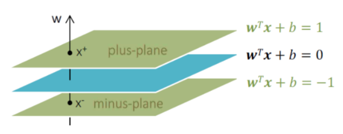

# SVM(Support Vector Machine)은 지금도 쓸만한 알고리즘 일까?

## Would SVM be a good option for tabular data nowaday?

🔥이번 Tutorial에서는 **SVM(Support Vector Machine)** 과 같은 고전적인 방법의 Machine Learning (Classification) 알고리즘이 쓸만한지에 대해서 **여러가지 Tabular Data와 다양한 다른 Algorithms (like Basic ANN, Deep Learning, XGBoost, etc.)** 의 성능(Accuracy)과 속도(Perforamance for Training and Testing)를 비교 해 보고자 한다.

이를 통해서 현재도 SVM과 같은 Algorithm이 일반적인 Tabular Data에서 Choice를 해도 되는 것인지 그 한계를 알아보고자 한다. 

특히 Deep Learning에 유리한 Big Data를 제외하고, 일반적인 Small Dataset에서의 성능을 비교해 보았다.

> 물론 Image, Text와 같은 비정형데이터나 Time-Series와 같은 Data에서는 Deep Neural Network를 사용하셔야 합니다. :)

# 1. Table of Contents

[TOC]

# 2. About SVM

## 2-1. Basic Concept

### Shatter란 무엇일까?
- Shatter란, 함수 F는 n개의 points를 shatter할 수 있다는 개념이다.
    - example) 선형 분류기는 d차원에서 (d+2)개의 점을 Shatter 불가능하다. 즉 2차원에서 아래와 같이 4개의 점은 shatter가 불가능하다.
    - 
    - 출처 : [VC Dimension – Support Vector Machines (SVMs)](https://www.svms.org/vc-dimension/)

### VC Dimension이란?
- 어떤 함수의 Capacity (like Model Complexity)를 측정하는 지표
- 다시말해, 함수 H에 의해 최대로 Shattered될 수 있는 Points의 수
    - 앞의 예시에서 선형 분류기의 VC Dimension은 2차원에서 3 (3개까지 분류 가능)

### Structural Risk Minimization (구조적 위험 최소화)

출처 : [(PDF) Neural Networks Regularization Through Representation Learning (researchgate.net)](https://www.researchgate.net/publication/326666897_Neural_Networks_Regularization_Through_Representation_Learning)

- 아래의 Training Error는 Emperical Risk를 나타내고, 보통 Machine Learning 알고리듬에서 Training과정에서 이 **Emperical Risk** , 즉 Training Error를 최소화 하려고 한다. (물론 Validation Set을 사용해 Overfitting을 사전 인식하고 학습을 멈춰야 함)
- **SRM(Structureal Risk Minimization, 구조적 위험 최소화)** 에서는 Model의 Complexity에 따라, 즉 VC Dimensino이 커짐에 따라 Training Error도 작아지지만, 동시에 Model의 Risk(Bound on test error)를 낮추는, 즉 동일한 정확도라면 상대적으로 복잡도가 낮은 모델이 선호되어야 한다고 이야기 한다.
  - 

- 해당 SRM 접근법에 있어서는, 수학적으로 잘 정의가 되어있고, VC Dimension이 올라가면(즉 모델 Complexity가 올라가면), 모델의 위험도가 높아진다.
  - 사실 Deep Learning에서의 Model Complexity에 따른 Overfitting과 동일한 개념이다.

- **다음에 설명할 SVM은 Margin을 최대화** 함으로써 VC Dimension을 최소화하고, 이를 통해 Capacity 항을 최소화 한다.
  - 
    - $h$ : VC Dimension, 이게 커질수록 구조적 위험은 커진다. 즉, 모델 Complexity인 VC Dimensinon을 작게 가져가야 한다.
    - $\Delta$ = Only 바꿀수 있는 Delta Margin --> Delta가 클수록, VC Dimension은 작아진다.

  - 
    - **VC Dimension이 작아질 수록, 구조적 위험(SRM)이 작아진다.**

## 2-2. About SVM

### Linear Classification Model

- 기본적으로 SVM은 선형 분류기 이다.

- 따라서 점을 2차원에서 3개까지만 분류가 기본적으로 가능하다. 그러나 향후에 설명할 Kernel Method(Or Kernel Trick)를 사용해  저차원 공간의 Data를 고차원으로 보냄으로써, 선형 분류 모델로 더 많은 Shatter가 가능하도록 한다. 즉, 선형분류를 좀 더 확장한다.

  - 

- 위에 설명한 것 처럼 SVM은 분류 Margin을 최대화 하는 분류기를 더 좋은 분류기로 판단한다.(SRM이 줄어들기 떄문)

  - 어느쪽이 더 좋은 분류기인가? (SVM입장에서는 우측이다.)
      - 

  - 여러 경계면 중, Margin을 최대화하는 우측 분류기가 좋은 분류기라고 SVM알고리듬은 정의 내린다.

    - 
- SVM은 Model내에서의 Unique Optimum을 찾을 수 있다. (Model에 대한 Global Optimum이라고 말할 수 있겠으나, Data에 대한 Global Optimum이라고 말할 수 있을까? 의문임. 실제로 최근엔 Deep Neural Network이 더 잘 Generalization한다.)

### SVM Vs. Neural Network
- 기존에는 Neural Network이 구조적 위험에 있어서 문제가 있었기 때문에 (Emperical Risk만 줄이도록 학습됨), Training시에 Overfitting문제로 잘 사용되지 않았음
- 특히 SVM은 Convex Optimization문제로, Unique한 Optimum을 찾을 수 있었기 때문에 수학적으로도, 성능적으로도 더 선호됨
- 그러나 Neural Network모델에서 데이터가 고차원이 되면서, High-Dimension에서는 Gradient가 0인 경우가 거의 없다는 사실이 밝혀져서, NN도 Local Optimum에 빠지지 않는다는 것을 알게 되었음. 또한 Dropout이나, Batch/Layer Normalization 등 Regularization 기법들이 나오기 시작하면서, SVM을 성능적으로 많이 제치게 되었다. 
    - 
    - 출처 : [[머신러닝/딥러닝] 6. Optimization for Deep Learning (sonsnotation.blogspot.com)](https://sonsnotation.blogspot.com/2020/11/6-optimization-for-deep-learning.html)

### Margin 최대화 하는 분류 경계면

- Margin을 최대화 해야 VC Dimension이 줄어들고 구조적 위험도 줄어든다. 그리서 우리는 Margin을 최대화하는 Hyper Plane을 찾아야 하는데, Binary Classification문제라고 할 때, 각 Class를 +1과 -1로 Labeling한다.
  
- SVM은 결국 y=wx+b로 표현되는 Linear Model이 Margin을 최대로 갖도록 세팅하는 것임
- Binary Class 각각을, wx+b >=1 이면 y label을 +1로, wx+b <= -1이면 y label을 -1로 mapping한다. (사실 +2, -2 등으로 해도 되지만, 계산상의 편의를 위해서 이렇게 진행)
- 다음과 같이 Hyper Plane을 그릴수 있으며
  - 

- 이때의 Margin은 아래와 같이 계산된다.
  - 

- 결국 SVM이란 것은 구조적 위험을 줄일 수 있는 Hyperplane의 Margin을 최대화하여 Classification을 선형으로 잘 하려는 모델이라고 볼 수 있다.

## 2-3 Linear SVM

### Hard Margin SVM (Basic Form)

- Hard Magin SVM은 가장 기본적인 형태로, 잘못 분류된  Case는 고려하지 않는 굉장히 Strict한 모델이다.
- **Object Function** 과 **Constraint **는 아래와 같다.
  - 

- Constraint가 있는 상태에서의 목적함수 최적화 이므로 **Lagrangian Problem** 형태로 풀어낼 수 있다.
  - 
  - 

### Soft Margin SVM

## 2-4 Kernel SVM

# 3. Competition for tabular data with other algorithms

위에서 우리는 SVM에 대해서 상세히 알아보았으니, 과연 SVM이 현재에도 Tabular Data에서 적절한 선택인지 비교를 해보자. 사용하는 Dataset과 알고리즘은 아래와 같다.

Go to tutorial notebooks

## 3-1. Setting

### Datasets

- 데이터셋은 아래와 같이 4개의 유명한 Tabular 형태의 Dataset을 사용합니다. 

|      | Datasets      | Description                                    | Num Instances | Num Inputs (Xs) | Num Classes (Ys) |
| ---- | ------------- | ---------------------------------------------- | ------------- | --------------- | ---------------- |
| 1    | Diabetes      | 당뇨병 환자 데이터 (0, 1)                      | 768           | 8               | 2                |
| 2    | Digits        | 0~9까지의 숫자 Dataset. Mini MNIST (8*8 Image) | 1797          | 64              | 10               |
| 3    | Iris          | Iris 꽃 데이터                                 | 150           | 4               | 3                |
| 4    | Breast Cancer | 위스콘신 유방암 데이터 (0, 1)                  | 569           | 30              | 2                |

### Algorithms

- Algorithm은 본 실험에서 다루고 있는 기본적으로 Linear SVM과 Kernel SVM을 사용한다. 2개의 Parameter를 Grid Search함 (7*6 조합)
- 비정형 데이터에 압도적인 Artifical Neural Network계열인, Basic ANN과 Google(2019)에서 만든 Tabular에 특화된 TabNet을 비교 대상으로 추가하였다. Neural Network계열은 시간이 오래 걸리므로, 따로 Grid Search하지 않음
- Boosting 계열인 XGBoost, LightGBM, CatBoost를 비교군으로 두었다. 3가지 모두 Kaggle과 같은 Competition에서 Tabular Dataset에 대하여 매우 뛰어난 성능을 보여주었다.(딥러닝 보다 좋은 경우 많음). 2개의 Parameter를 Grid Search함 (7*6 조합)
- Bagging계열이며 실제로도 현업에서 매우 좋은 성능을 갖고 있는 Random Forest를 사용하여 비교하였다. 2개의 Parameter를 Grid Search함 (7*6 조합)
- SVM의 Bayesian버전인 RVM(Relevance Vector Machine) 도 비교군으로 삼음. MS가 특허를 갖고 있었음 (2019년 특허 만료) RVM은 Hyperparameter가 적은 편이며 자동 추정이 가능함. 그러나 Training 시간이 오래 걸려 따로 Grid Search하지 않음. 특히 Training시 O(N^3)라 오래 걸림. Inference Time은 매우 짧음. SVM과 달리 Global Optimum을 보장하지는 않으나, 실험적으로 SVM보다 Generalization에 좋은 편임. RVM은 Big Dataset에서 매우 느리다는 단점과 함께, RVM이 뜰 때 쯤, Deep Learning이 떠서 안타깝게 잘 사용하지는 않음. Small Dataset에서는 Gaussian Process와 함께 매우 Accuracy가 높다고 알려져 있음

|      | Algorithm                    | Description                                                  |
| ---- | ---------------------------- | ------------------------------------------------------------ |
| 1    | Linear SVM                   | 선형 SVM                                                     |
| 2    | Kernel SVM                   | 선형 SVM + Kernel Trick(using rbf kernel)                    |
| 3    | Basic ANN                    | 기본적인 Artifical Neural Network. 1개의 Intput Layer와 2개의 Hidden Layer, 1개의 Output Layer로 구성됨. 200 epochs 돌림. Dropout 최적화 및 SELU Activation을 사용으로 Small Tabular Dataset상에서 경험적으로 일부분 최적화된 세팅을 갖춤 |
| 4    | TabNet (Deep Learning Model) | Transformer를 사용한 Tabular에 특화된 최신(2019) 딥러닝 모델. Kaggle에서 Boosting계열을 뛰어넘는 좋은 성능을 나타냄. 특히 Data가 많을수록 성능 향상치가 높음. 100 epochs 돌림. Small Dataset에서는 약함 |
| 5    | XGBoost                      | Boosting계열의 대표주자. 속도를 극한으로 추구하며, 동시에 Generalization 능력도 탁월함. Hyperparameter가 매우 많음 |
| 6    | LightGBM                     | Boosting계열의 대표주자 2. Hyperparameter가 매우 많음        |
| 7    | CatBoost                     | Boosting계열의 대표주자 3. Hyperparameter가 매우 많음        |
| 8    | Random Forest                | Bagging계열의 대표주자. 많은 Case에 있어서 SVM보다 좋은 성능을 나타냄. 그러나 SVM보다 Hyper parameter가 많은게 또 단점임 |
| 9    | Linear RVM                   | Linear버전의 RVM. Bayesian방식으로 변형된 버전의 SVM.        |
| 10   | Kernel RVM                   | RVM의 rbf kernel을 사용한 버전.                              |

## 3-2. Result (Accuracy, %)

- Dataset은 Testset 20%, Training 72%, Validation 8%를 기준으로 진행하였다.
- Accuracy는 Testset에 대해서만 계산하였다. (당연히!)
- 모델은 Validation 기준으로 Loss가 가장 적은 Best Model로 Testing을 진행함

|      | Algorithm                    | Diabetes     | Digits       | Iris         | Breast Cancer |
| ---- | ---------------------------- | ------------ | ------------ | ------------ | ------------- |
| 1    | Linear SVM                   | <u>81.16</u> | 97.77        | 96.66        | 98.24         |
| 2    | Kernel SVM (rbf)             | **83.11**    | **99.16**    | 96.66        | 98.24         |
| 3    | Basic ANN                    | 78.57        | <u>97.78</u> | **100**      | <u>98.25</u>  |
| 4    | TabNet (Deep Learning Model) | 79.22        | 96.94        | 76.66        | 92.98         |
| 5    | XGBoost                      | **83.11**    | 96.11        | 96.66        | 95.61         |
| 6    | LightGBM                     | 77.92        | 96.66        | 96.66        | 93.85         |
| 7    | CatBoost                     | 80.51        | 97.77        | 96.66        | 96.49         |
| 8    | Random Forest                | 75.97        | 96.66        | 96.66        | 97.36         |
| 9    | Linear RVM                   | **83.11**    | 95.55        | <u>96.99</u> | **99.12**     |
| 10   | Kernel RVM                   | **83.11**    | 95.00        | 96.66        | 97.36         |

## 3-3. Result (Training Time, sec)

- CPU : AMD Ryzen 7 5800U 사용 (Balanced Mode)
- GPU : Nvidia Mobile 3050ti 사용

|      | Algorithm                    | Diabetes                | Digits                  | Iris        | Breast Cancer |
| ---- | ---------------------------- | ----------------------- | ----------------------- | ----------- | ------------- |
| 1    | Linear SVM                   | **0.69**                | **1.62**                | **0.08**    | **0.21**      |
| 2    | Kernel SVM                   | 4.30                    | <u>34.91</u>            | <u>0.58</u> | <u>1.83</u>   |
| 3    | Basic ANN                    | 110.09 (GPU, 200epochs) | 174.86 (GPU, 200epochs) | 7.39        | 27.62 (GPU)   |
| 4    | TabNet (Deep Learning Model) | 149.32 (GPU, 100epochs) | 345.10 (GPU, 100epochs) | 29.91       | 106.47 (GPU)  |
| 5    | XGBoost                      | 9.44                    | 47.81                   | 8.34        | 7.70          |
| 6    | LightGBM                     | <u>4.02</u>             | 44.31                   | 4.59        | 6.03          |
| 7    | CatBoost                     | 20.90                   | 58.90                   | 18.41       | 41.69         |
| 8    | Random Forest                | 25.47                   | 41.16                   | 24.65       | 33.16         |
| 9    | Linear RVM                   | 102.08                  | 2371.65 (39분 소요!)    | 45.46       | 74.22         |
| 10   | Kernel RVM                   | 85.93                   | 1846.79 (30분 소요!)    | 30.16       | 80.05         |

## 3-4. Result (Inference Time, sec)

- CPU : AMD Ryzen 7 5800U 사용 (Balanced Mode)
- GPU : Nvidia Mobile 3050ti 사용

|      | Algorithm                    | Diabetes      | Digits           | Iris          | Breast Cancer |
| ---- | ---------------------------- | ------------- | ---------------- | ------------- | ------------- |
| 1    | Linear SVM                   | 0.0033        | 0.0088           | **0.0001**    | <u>0.0009</u> |
| 2    | Kernel SVM                   | 0.0061        | 0.042            | 0.0010        | 0.0019        |
| 3    | Basic ANN                    | 0.0016 (GPU)  | **0.0029 (GPU)** | 0.0020 (GPU)  | 0.0019 (GPU)  |
| 4    | TabNet (Deep Learning Model) | 0.1037 (GPU)  | 0.2753 (GPU)     | 0.0263 (GPU)  | 0.1176 (GPU)  |
| 5    | XGBoost                      | 0.0020        | 0.0053           | 0.0030        | 0.0034        |
| 6    | LightGBM                     | **0.0009**    | 0.0050           | 0.0010        | <u>0.0009</u> |
| 7    | CatBoost                     | 0.0019        | 0.0110           | <u>0.0009</u> | 0.0046        |
| 8    | Random Forest                | 0.0029        | 0.0288           | 0.0029        | 0.0066        |
| 9    | Linear RVM                   | <u>0.0010</u> | 0.0076           | 0.0020        | 0.0010        |
| 10   | Kernel RVM                   | 0.0013        | <u>0.0037</u>    | 0.0032        | **0.0001**    |

# 4. Final Insights

## 4-1. Training Time 관점

- **SVM은 타 방식 대비 전반적으로 장점을 갖고 있음** ✅

- SVM은 전반적으로 Training Time이 매우 우수하며, 같은 시간 대비 Boosting, Bagging, NN, RVM 계열들 대비 다양한 Hyper Parameter를 탐색할 수 있음. SVM보다 빠른 방식은 크게 차이는 나지 않으나 Diabetes Dataset에서의 LightGBM정도 밖에 존재하지 않았음 (그러나 Parallel Threading을 쓴다면 Boosting 계열이 더 빠를 수 있음)
- 물론 Training Time 등의 속도는 어떠한 언어로 된 구현체(ex. C, Rust 등)인지에 따라 다르고, Coding Trick을 썼느냐에 따라 다를 수 있음. 그리고 SVM은 매우 Optimization된 Code로 Scikit-Learn에 구현되어 있기 때문에 이러한 결과를 보였을 것 같음. 그러나 XGBoost나 LightGBM같은 경우도 속도를 높이기 위한 다양한 방식(ex. Cache Hit Optimization 등)을 사용하기 때문에, 완전 다른 알고리즘이 불리하다고 보기는 힘듬.
- 그러나 XGBoost 같은 경우 알고리즘 구현 방식 자체가 Thread Processing을 가정하기 때문에, single thread기반에서는 속도적 이득을 얻기가 힘드리라 봄
- 따라서 ARM Cortex A가 아닌, 그 외의 Real-Time Embedded System에서의 Training에서는 SVM이 타 알고리즘을 압도하는 속도적인 이익을 얻을 것이라 생각됨
- 그리고 Tabular Data에서 Hyper Parmeter Searching을 가미한 Baseline 모델을 찾아내는데 SVM이 매우 적합하리라 생각됨

## 4-2. Testing Time의 관점

- **SVM은 타 방식 대비 Big Dataset에서는 단점을 갖고 있음** ❌
- **그러나 SVM은 타 방식 대비 Small Dataset에서는 나쁘지 않는 속도를 갖고 있음(Single Thread Embedded Real-Time System에 적합)** ✅

- Diabetes는 700개 정도의 Dataset인데, 이정도 크기 이후부터 Testing에서는 SVM이 다른 방식 대비 빠른 속도를 보이지는 않음. 물론 GPU를 사용하지 않는 NN계열보다는 빠를 수 있겠으나, Boosting, Random Forest, RVM 등에 모두 속도가 밀림

- 그러나 Small Dataset을 한번에 Testing할 때에는 장점을 갖추고 있음. 이를 보았을때 Single Thread의 Embedded System에서 Real-Time Inference나 FPGA, ASIC으로 구현했을때의 속도는 SVM이 가장 빠르리라 생각됨 (특히 Testing Time에 Single Instance를 처리하는 속도가 가장 빠르리라 예상)

- 알고리즘 특성상 Boosting계열에서 정렬 등이 필요하여 이때 Boot-up되는 속도가 SVM대비 오래 걸리는 것으로 추정됨

  

## 4-3. Accuracy의 관점 

- **SVM이 타 방식 대비 Accuracy가 유사하거나 더 좋은 경우도 있음** ✅
- Accuracy도 SVM이 전체적으로 모든 Dataset에서 다른 알고리즘 대비 가장 좋거나(Diabetes, Digits), 2~3위 수준(Irs, Breast Cancer)의 Accuracy를 나타냄. 
- 특히나 Linear SVM (Soft Margin)이 다른 모델들 대비 크게 떨어지지 않는 Accuracy를 보여줌으로써, Kernel이 필요한 특이한 Case의 임의로 생성된 Dataset이 아닌한, 매우 빠르고 정확하게 Classification을 하는 능력을 갖추었다고 보여짐. 특히나 Dimension이 커지면서 Linear Model로 분류되는 Hyper Plane을 찾기가 더 쉽지 않을까 생각됨.
- 물론 Dataset이 크지 않고 단순하며, 전반적으로 Accuracy가 유사하게 높으므로(물론 Use-Case에 따라서 0.1% Accuracy도 매우 크다고 볼 수 있긴 하지만) 이 결과로만 가지고 SVM이 다른 알고리즘보다 확실히 뛰어나다고 볼수는 없음.
- 그러나 확실한건, **Training Time과 Testing Time대비, SVM이 다른 최신의 알고리즘보다 떨어진다고 보기 어려우며, 오히려 더 좋은 경우 있다고 말할 수 있음**.  따라서 Silver Bullet은 없으므로, SVM알고리즘을 실무에서 꼭 검증 해 볼 필요는 있음

## 4-4. 그 외

- 그 외 Tabnet같은 경우 좋은 성능을 내지 못하는 경우가 있는데, Dataset에 적은 경우 특히나 그러하며(Iris, Breast Cancer), Tabnet은 category encoding에 유리한 측면이 있다고 보여, 좀 더 복잡한 column을 가진 dataset, 좀 더 큰 dataset에서 활용되면 좋을 것이라 생각됨
- 그리고 Basic ANN은 Dropout과 SELU등의 활용으로 Tabular에서 다른 알고리즘 못지않은 성능을 보일 수 있다는 것을 확인함
- 또한 RVM은 타 알고리즘 대비 Training Time이 상대적으로 매우 길었지만, Testing Time은 타 알고리즘대비 매우 빠른 편임. 또한 성능도 DIgits Dataset 외에는 타 알고리즘 대비 상대적으로  높은 성능을 보이고 있음. 
- 그러나 RVM은 Digits 데이터가 1700개 가량 밖에 안되는 경우에도, 35분이나 걸리는 아주 긴 Training시간을 갖음. 따라서 RVM은 Small Dataset에서만 꼭 고려해야할 알고리즘으로 생각됨(Hyper Parameter Tunning도 자동으로 이루어질 수 있으며, Output에 대한 Uncertainty를 구할 수 있음)
- RVM Training의 빠른 구현 Tipping, M., & Faul, A. (2003). Fast marginal likelihood maximization for sparse Bayesian models도 존재하므로, 해당 구현을 사용한다면 이번 Tutorial의 구현보다는 더 긍정적인 느낌을 받았으리라 생각됨
- Random Forest는 전반적으로 Training Time이나 Testing Time에서 큰 장점은 없었으며(빠른 편이 아니었음), Accuracy 성능 역시 다른 알고리즘 보다 딱히 뛰어나다고 보이지는 않음(Breaset Cancer제외 Boosting보다 전반적으로 떨어짐). 향후에는 Random Forest보다는, SVM, Boosting, RVM을 좀 더 고려하지 않을까 생각이 듬 (물론 Hyper Parameter를 좀 더 테스트 하면 다를 수는 있을 듯)
- Boosting 계열에서 비교하자면, 속도 측면에서는 LightGBM이 빠른 편이지만 Accuracy 측면에서는 XGBoost나 CatBoost가 더 좋은 성능을 보이며 속도도 크게 느리지는 않음. LightGBM보다 XGBoost나 CatBoot를 좀 더 고려하는게 좋지 않을까 생각됨

## 4-5. 결론

- 결론적으로는 SVM알고리즘은 지금도 쓸만한 알고리즘이라고 말할 수 있음.
