# Anomaly Detection의 한계를 알아보자.


## The limitation of anomaly detection algorithm


🔥이번 Tutorial에서는 Anomaly Detection이 실제 Practical한 상황에서 어떠한 제약점이 있는지 파악해 보고, 어떠할 때 쓰면 안되는지 확인 해 보고자 한다. 확인해보고자 하는 문제는 2가지 이다.


### 1. Anomaly Detection for "Regression To Anomaly Detection"

- Manufacturing 공정 등의 Data는 기본적으로 Target값이 Continuous한 경우가 많이 있다. 이런 경우, 특정 Threshold 이상의 값은 '이상치(Anomaly)'로, Threshold 이하의 값은 '정상치(Normal)'로 Target Data를 Binary Categorization을 하여, Anomaly Detection이나 Classification으로 문제를 풀려는 시도를 일반적으로 많이 생각한다.

- 따라서 이렇게 근본적으로 Regression Task인 것들을 Thresholding하였을 때, 과연 Anomaly Detection과 같은 알고리즘이 잘 동작하는지 테스트를 진행 해 보았다. (특히 현업의 Manufacturing 공정에서는 대부분이 '정상'데이터이며 '이상'데이터는 매우 적은 Imbalanced한 Data가 대부분의 Case이다. 그러나 이번 실험에서는 Regression을 통한 Imbalanced한 부분을 없애기 위하여 Normal Class와 Abnormal Class를 5:5 수준으로 나누었다.)

- 이를 통해 Anomaly Detection을 근본적 Regression Task에 써도 될지, 그 한계를 알아보려고 한다.

### 2. Anomaly Detection for "Classification To Anomaly Detection"

- 일반적으로 Unsupervised기반의 Anomaly Detection보다 Supervised Classification이 성능이 더 높은 경우가 많이 있다.
- 실제로 간단한 Task에서 Anomaly Detection이 Supervised Classification보다 어느정도의 성능의 차이가 있는지 알아보려 한다.
- 이를 통해 Anomaly Detection이 Supervised Classification Task에 써도 될지, 그 한계를 알아보려 한다.


위의 2가지 문제를 우리는 2가지 Tutorial을 통해 알아보고자 한다. 


# Table of Contents

- [Background of Anomaly Detection](#Background-of-Anomaly-Detection)

  - [1. Basic Concept](#1-Basic-Concept)
  - [2. One-Class SVM](#2-One-Class-SVM)
  - [3. Isolation Forest](#3-Isolation-Forest)
  - [4. Auto-Encoder for Anomaly Detection](#4-Auto-Encoder-for-Anomaly-Detection)
  - [5. Mixture of Gaussian](#5-Mixture-of-Gaussian)

- [Tutorial 1. Regression To Anomaly Detection](#Tutorial-1-Regression-To-Anomaly-Detection)

  - [1-1. Tutorial Notebook](#1-1-Tutorial-Notebook)
  - [1-2. Setting](#1-2-Setting)
  - [1-3. Usage Code](#1-3-Usage-Code)
  - [1-4. Result (Accuracy)](#1-4-Result_Accuracy)

- [Tutorial 2. Classification To Anomaly Detection](#Tutorial-2-Classification-To-Anomaly-Detection)

  - [2-1. Tutorial Notebook](#2-1-Tutorial-Notebook)
  - [2-2. Setting](#2-2-Setting)
  - [2-3. Usage Code](#2-3-Usage-Code)
  - [2-4. Result (Accuracy)](#2-4-Result_Accuracy)

- [Final Insights](#Final-Insights)

  - [1. Regression To Anomaly Detection](#1-Regression-To-Anomaly-Detection)
  - [2. Classification To Anomaly Detection](#2-Classification-To-Anomaly-Detection)
  - [3. Conclusion](#3-Conclusion)

- [References](#References)

  

-------

# Background of Anomaly Detection

## 1. Basic Concept

Anomaly Detection(이상탐지)란 말 그대로 Data상에서 정상(Normal)에서 벗어난 이상(Anomaly) 데이터를 탐지 해 내는 기술이다. 다양한 기법이 있으나, 기본적으로는 정상(Normal) 데이터로만 데이터를 학습하여, 그 정상 Distribution을 일정 범위 벗어나는 것들을 Anomaly로써 Detection하는 기술이다. 즉, Unsupervised Learning 계열이라고 볼 수 있다. (정확히는 Semi-Supervised 혹은 Self-Supervised Learning)

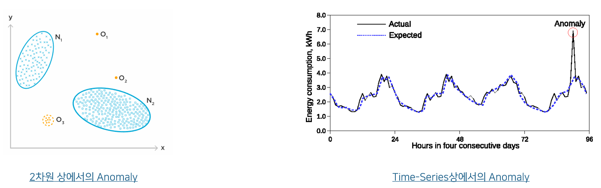


이상탐지는 아래와 같이 Supervised Anomaly Detection(사실 Classification임), Unsupervised Anomaly Detection, Semi-Supervised Anomaly Detection으로 나뉠 수 있다. 정확히는 이렇게 나뉘지만 편의상 많은 사람들이 혹은 본 Tutorial에서는 Unsupervised와 Semi-Supervised를 따로 구별하지 않고 Unsupervised로 부르도록 하겠다. (Semi-Supervised 중 정확히는 One-Class Learning이다.)

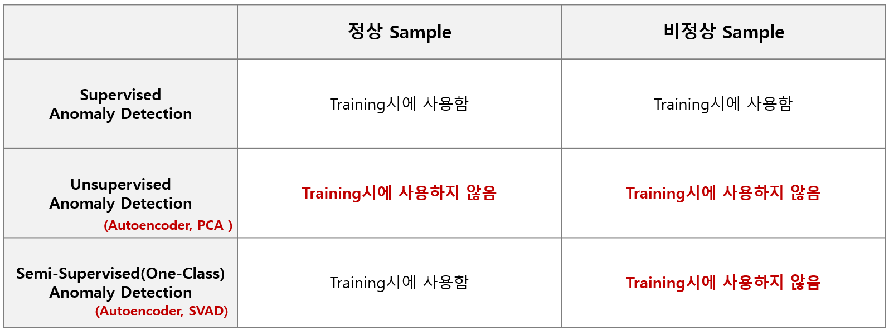


Anomaly Detection은 Class Label이 없거나, 정상 Label만 있을 경우 혹은 이상 Data가 굉장히 적은 Imbalanced Dataset 상황에서 사용해 볼 수 있는 좋은 방법론 중 하나이다. 그러나 이 Tutorial에서 다루려는 내용도 마찬가지지만 Anomaly Detection은 정확한 Context에 맞는 상황에서 사용해야 하며, 아무 상황에서나 적용해서 쉽게 성능을 낼 수 있는 방법론은 아니다. 따라서 아래와 같은 알고리즘 선택(Anomaly Detection vs. Classification)의 Decision Making Process를 따르는 것이 좋다. (해당 의사결정방법론은 고려대학교 산업경영공학부 강필성 교수님 Reference입니다.)

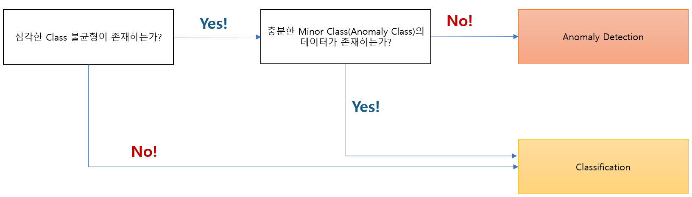

Anomaly Detection은 크게 Density Based, Model Based, Distance Based로 3가지 Taxonomy로 나누어서 생각해 볼 수 있다. 하기 부터는 Model Based인 One-Class SVM, Isolation Forest, Autoencoder에 대해 다루고, Density Based 중 매우 많이 사용되는 Mixture Of Gaussian(Gaussian Mixture Model) 기법에 대해서 간단히 정리 해 보고자 한다. 


그리고 해당 이론적인 내용을 간단히 파악하고 2가지 Tutorial에서 각 알고리즘을 사용해 특정 Case에서 알고리즘들이 어느정도의 성능을 나타내는지 비교해 보도록 하겠다.


## 2. One-Class SVM

먼저 Model-Based Anomaly Detection 중 하나인 One-Class SVM을 다뤄 보겠다(정확하게는 Nu-SVM). 이 SVM의 Variation은 정상(양품) Class에 대해서만 학습을 진행하고, 그 학습의 Boundary를 벗어나는 것들을 불량으로 분류한다. 이는 SVM에서 Support Vector로 구성되는 2개의 Margin으로 Binary Classification을 수행하는 것과 유사하게, One-Class SVM은 원점을 기준으로 정상 Class의 Data까지의 거리(p)를 최대화 하는 목적 함수를 학습하게 된다.


그림으로 표현하자면 아래와 같고, 원점 0에서 부터 Margin와 거리 p를 최대화할 수 있는 결정 평면을 학습하게 된다.

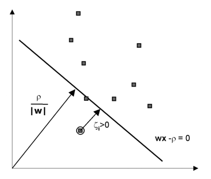

이의 목적함수(Objective Function)과 분류를 위한 Decision Function을 수식으로 표현하자면 아래와 같다. 해당 One-Class SVM도 Dual Largrangian Problem으로 변환하여 최적화 식을 도출 할 수 있다.

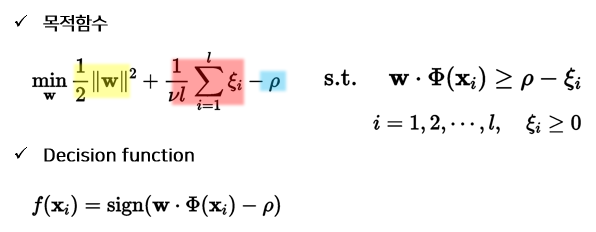


이 Nu-SVM외에 SVDD(Support Vector Data Description)이라는 방법론도 있는데(정상 Data를 감싸는 가장 작은 반지름을 갖는 Hypershpere를 찾는 것을 목적으로 함), 결론적으로는 두개의 기법이 거의 동일한 수식(모든 데이터가 Unit norm vector로 Normalized 되어있을 때 SVDD와 Nu-SVM은 Equivalent함)으로 전개되기 때문에 따로 설명을 하지는 않는다.


## 3. Isolation Forest

두번째로 다룰 Model-Based Anomaly 기법은 Isolation Forest이며, Decision Tree를 사용한 기법이다. Isolation Forest는 굉장히 단순한 아이디어를 바탕으로 알고리즘이 설계 되었다. 일단 당연하게도 Anomaly는 소수의 Data라는 점이고 또한 정상 분포와는 다른 분포에 속할 것이라는 가정이다.(일반적으로 할 수 있는 가정임). 이를 통하여 Isolation Forest는 Random한 수직/수평의 직선으로 Data를 분할 했을 때, 각 Feature별로 잘 분할이 안되는 Data는 정상(Noramal) 데이터로, 쉽게 분류가 되어 고립(Isolation)이 되는 Data는 이상(Anomaly) 데이터로 판단한다.


아래의 좌측 처럼 정상 Data들은 정상 Data로써 다수가 몰려 있기 때문에 각 Data를 고립시키가 어렵지만, 아래의 우측처럼 이상 Data는 몇번의 고립(분리)으로도 쉽게 분류가 된다.

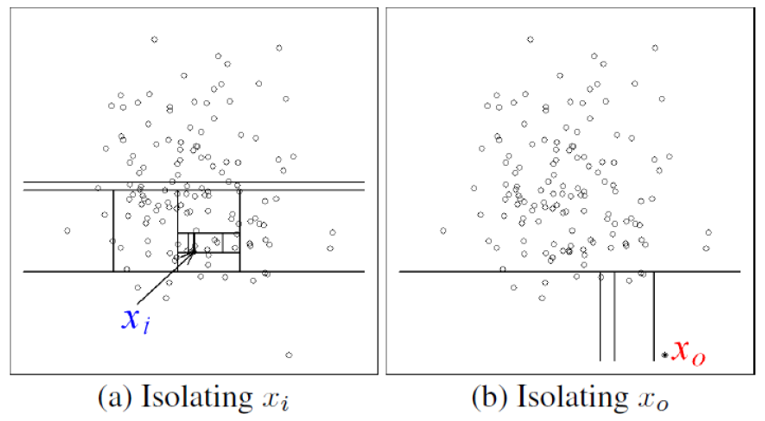

따라서 Isolation Forest는 Decision Tree로 분류를 해 나갈때, 몇번이나 Tree가 분기되었느냐에 따라 그 Split 수가 크면 Normal, 그 수가 작으면 Anomaly라고 판단내리게 된다.

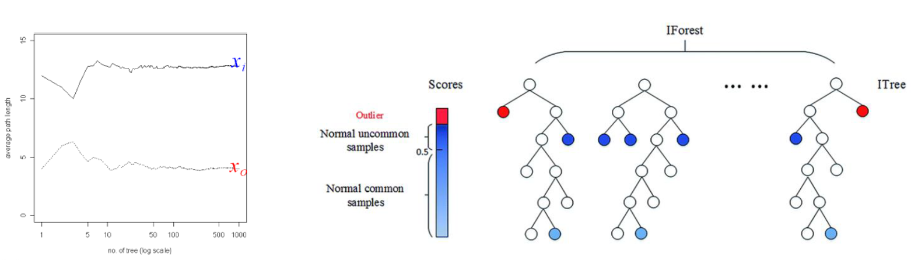

각 개별 분류를 통해 Path Length를 구하고 그를 통해 Novelty Score를 구하게 되는데, 이런식으로 반복적인 계산을 하다보니 상대적으로 계산량이 많아 Training시에 다른 알고리즘보다 많은 시간을 소요하게 된다는 단점이 있다. 그러나 Data Score가 아래와 같은 수식으로 계산되어 항상 0~1 사이의 값을 Output하기 떄문에 그 해석이 쉽다는 장점이 있다. (정상:0, 이상:1)

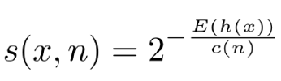


## 4. Auto-Encoder for Anomaly Detection

마지막으로 다룰 Model-Based Anomaly Detection은 Neural Network기반의 Auto-Encoder를 사용한 Anomaly Detetion기법이다. Auto-Encoder는 이제 모르는 사람이 없을 정도로 유명하고 굉장히 Simpe하며 다양한 Application을 가진 기법이라고 할 수 있다. Unsupervsed로도, Semi-Supervised로도 사용할 수 있는 기법이다. 또한 굉장히 유연하여 다양한 딥러닝 기법들을 다양하게 적용해 볼 수 있는 현재도 많이 사용되는 기법이라고 볼 수 있다. 그 중 우리는 가장 단순한 Auto-Encoder를 이야기 해 보겠다.

일반적으로 Classification은 아래와 같이 Feature를 Extraction하는 Encoder부분만 사용하여 Classification을 수행한다. Encoding된 Feature를 마지막 Classifier에서 분류 Task를 수행한다.

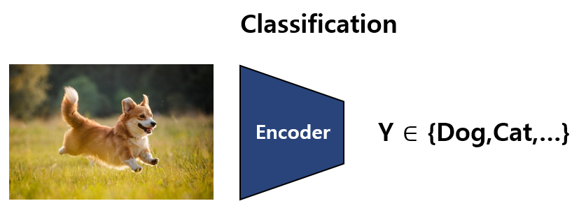


반면에 Autoencoder는 Encoder와 Decoder로 이루어져, 입력데이터를 받으면, 그 입력 데이터와 동일한 데이터를 출력데이터로 예측하려는 모델이다. 그러나 이때 중요한 것은, Encoder는 Feature를 Extract하기 위하여, 더 적은 Feature개수로 Encoding해야하며, Decoder는 Extracted된 더 적은 Feature에서 다시금 Decoding을 통해 Input Feature와 동일한 Output Feature를 내보내도록 한다. 

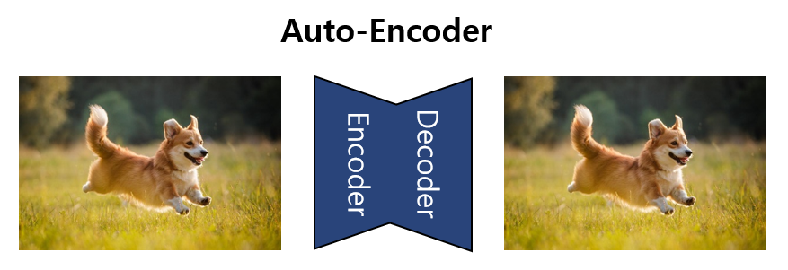

Auto-Encoder를 Anomaly Detection Task에 사용하기 위해서는 아래와 같이, Input값과 Decoding된 Output값의 차이를 Reconstruction Error로 정의하여, 그 Error를 Threshold하여 그 값이 크면 Anomaly로, 작으면 Normal Class로 분류를 하게 된다. 아래의 그림처럼 Image의 경우 Pixel Level로 Anomaly Score를 계산하고, Summation을 Reconstructin Error로 사용해 Anomaly Detection을 수행한다.

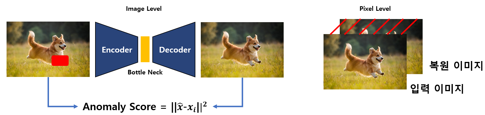

## 5. Mixture of Gaussian

Mixture Of Gaussian (MoG)는 여러개의 Gaussian Distribution을 선형 결합하여 Normal Data Distribution을 학습하고, 비정상 Data가 왔을 경우 확률 값이 특정 값보다 낮을 때 Anomaly로 Classificatino하는 방법론이다.

아래의 예시는 4개의 Gaussian Distribution을 통해 Data를 Fitting하여 Linear Combination한 MoG를 나타내고 있다. 검은색 점선인 Actual Data에 거의 유사하게 Gaussian Mixture Model(Mixture of Gaussian)이 Fitting한 것을 알 수 있다.

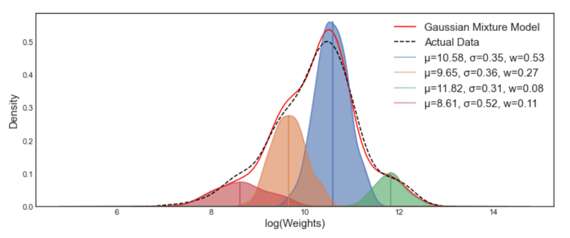

최적화 해야하는 식은 아래와 같다. 아래에서 g는 개별 Gaussian Distributiom을 나타내며, m개의 Gaussian Distribution이 있고, weight를 나타내는 w를 통하여 각각의 Gaussian의 기여를 Linear Combination하는 것을 나타낸다.

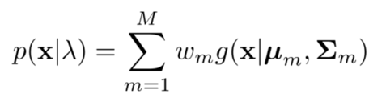

MoG는 Latent Vector인 Weight의 존재로 인하여, 각각의 m Cluster에 따른 최적값을 Mu값과 Sigma값과 함께 동시에 최적화 하기가 어렵다. 따라서 이를 최적화 하기 위하여 Sequential한 Optimization기법인 EM(Expectation-Maximizaiton) Algorithm을 통해 최적화를 수행한다. 이는 최적화할 때 각각의 Parameter를 고정하면서 하나씩 최적화 해 나가는 방법이다.

일단 아래와 같이 Expectation단계에서는, 아래에 네모 친 Weight, Mu, SIgma를 고정하고, 어떠한 m Cluster에 데이터가 생성될지에 대하여 확률 값을 최적화를 해 준다.

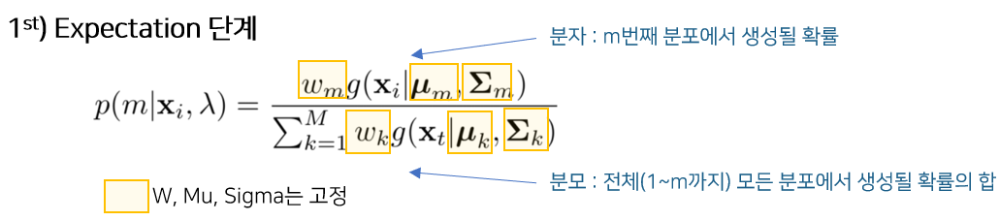

다음으로 Maximization 단계에서는 아래와 같이, **p(m|x_i, lambda)**는 위의 Expectation단계에서 구해진 값으로 고정해 놓고, 각각의 weight와 mu, sigma를 개별적으로 최적 화 해 준다.

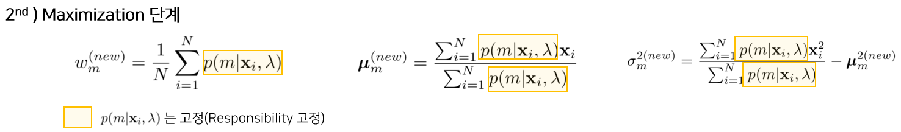

위의 Expectation과 Maximization을 하나씩 수행하면서, 더이상 각 Parameter값이 변하지 않고 수렴하게 되면 멈추게 되는 것이 바로 EM알고리즘이다. 이를 통해 학습을 해 나가면 아래와 같이 분포를 MoG가 학습하게 된다.


----

# Tutorial 1. Regression To Anomaly Detection

이번 튜토리얼에서는 앞서 설명한 것과 같이 근본적으로 Regression인 Task를 Threshold를 통해 Anomaly Detection (일종의 One-Class Binary Classification)이 가능할지 알아보는 실험이다. 해당 실험을 위해 우리는 하나의 Regression(SVR)과 여러 Anomaly Detection 알고리즘의 성능을 비교 하고자 한다.

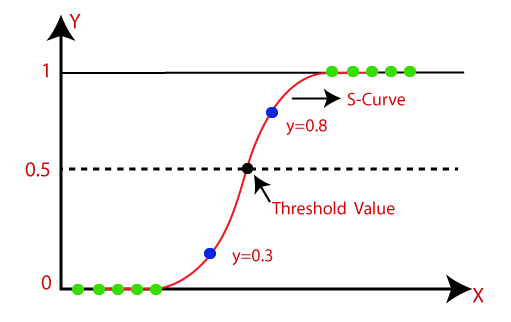

위와 같은 Logistic Regression이 아마 유사한 개념이라고 볼 수 있다. Regression 결과(Logit)를 확률로 변환하여(Logistic), 0.5라는 Threshold로 나눠서 Classification을 하는 것과 유사한 개념으로 Regression을 사용해 Threshold하여 Classification을 하는 아주 직관적인 방법과 Anomaly Detection의 비교라고 이해하면 되겠다.


## 1-1. Tutorial Notebook 

### 🔥[Go to the tutorial notebook](https://github.com/Shun-Ryu/business_analytics_tutorial/blob/main/3_anomaly_detection/Tutorials/tutorial_anomaly_detection_from_R_task.ipynb)


## 1-2. Setting

### Datasets

데이터셋은 아래와 같이 2개의 유명한 Tabular 형태의 Regression Dataset을 사용한다. 두개의 Dataset모두 Regression Target이므로 Thresholding을 통해 목적에 맞게 수정하여 사용한다. 전체 데이터 중 Training Set은 64%, Validation Set은 16%, Test Set은 20%의 Data비율로 나누었다.

|      | Datasets                        | Description                                                  | Num Instances | Num Inputs (Xs) | Num Outputs (Ys) |
| ---- | ------------------------------- | ------------------------------------------------------------ | ------------- | --------------- | ---------------- |
| 1    | Diabetes (Regression)           | 당뇨병 환자 데이터 (1년 후 당뇨의 진행정도를 Target값으로 함) | 442           | 10              | 1                |
| 2    | Boston House Price (Regression) | Boston의 집값에 대한 Data                                    | 506           | 13              | 1                |

데이터셋은 아래와 같은 코드로 불러오게 된다.

```python
if dataset_name == 'diabetes_r':
    x, y= datasets.load_diabetes(return_x_y=true)
elif dataset_name == 'boston_r':
    data_url = "http://lib.stat.cmu.edu/datasets/boston"
    raw_df = pd.read_csv(data_url, sep="\s+", skiprows=22, header=none)
    x = np.hstack([raw_df.values[::2, :], raw_df.values[1::2, :2]])
    y = raw_df.values[1::2, 2]
else:
    pass
```

각 Dataset은 Regression Target이므로, 각 Dataset을 Anomaly에 사용하기 위하여 사용되는 Threshold값은 아래와 같다. 각 값은 전체 데이터의 Median 값이다. Regression Task에 Imbalanced에 의한 영향을 줄이기 위해 중앙값을 사용하여 양불 Data의 Balance를 맞추었다.

- **Diabetes : 140** 
- **Boston House Price : 21**


### Algorithms

알고리즘은 아래와 Regression 알고리즘과 Anomaly Detection을 서로 비교한다.

- Regerssion 
  - SVR을 사용하여 Regression Task에서 Regression Algorithm을 사용하고 예측한 값을 특정 Threshold로 Classification하여 양불을 판정하는데 사용한다.
- Anomaly Detection
  - 4가지의 알고리즘(One-Class SVM, Isolation Forest, Autoencoder Anomaly Detection, Mixture Of Gaussian)을 사용하여, 데이터를 양불로 Binary Classification문제로 전처리 후, 양품 데이터만을 학습하여 Anomaly를 탐지한다.

|      | Algorithm                              | Target            | Description                                                  |
| ---- | -------------------------------------- | ----------------- | ------------------------------------------------------------ |
| 1    | Linear SVR                             | Regression        | 선형 SVR                                                     |
| 2    | Kernel SVR                             | Regression        | 선형 SVR + Kernel Trick(using rbf kernel)                    |
| 3    | One-Class SVM                          | Anomaly Detection | 양품 Sample만으로 학습하여 Anomaly Detection을 수행하는 SVM의 변형 버전(Nu-SVM). 양품 Sample Data가 원점에서 가장 멀어지게 하는 Hyper Plane을 찾는다. |
| 4    | Isolation Forest                       | Anomaly Detection | 양품 Sample만으로 학습하여 간단한 Decision Tree 조합을 통해 Anomaly를 Detection하는 알고리즘. 분류 Path Length가 길수록 양품이다. |
| 5    | Autoencoder<br />for Anomaly Detection | Anomaly Detection | 양품 Sample만을 통해 Neural Network기반으로 데이터를 압축하고, 동일하게 Reconstruction하는 Task를 수행하여, Anomaly Detection하는 알고리즘 |
| 6    | Mixture of Gaussian                    | Anomaly Detection | 여러개의 Gaussian의 선형 결합을 통해 분포를 벗어나는 Data를 찾아내어 Anomaly Detection을 수행하는 알고리즘 |


## 1-3. Usage Code

### SVR

성능이 어느정도 검증된 기법인 SVR을 사용하여, Regression Task를 예측한다. 그리고 예측된 결과를 Threshold로 나누어, 양불을 판정한다. 아래와 같은 코드로 학습과 추론하여 Regression을 예측한다. Linear SVR과 RBF SVR을 사용하였으며, param_grid에 있는 Hyper-parameter를 Grid Search하여 모델 최적화를 진행하였다.

```python
param_grid = [
    {'kernel': ['linear'], 'C': [1.0, 2.0, 3.0, 10., 30., 100.]},
    {'kernel': ['rbf'], 'C': [1.0, 2.0, 3.0, 5.0, 10., 30., 100.],
    'gamma': [0.01, 0.03, 0.1, 0.3, 1.0, 3.0]},
]

elapsed_time_kernel_svr = []

svr_regressor = SVR(kernel='rbf')
# svm_classifier = svm_classifier.fit(x_train, y_train)

start_time = datetime.now()
grid_search = GridSearchCV(svr_regressor, param_grid, cv=7, scoring="neg_mean_squared_error", verbose=2)
best_svr_regressor = grid_search.fit(x_train, y_train)
elapsed_time_kernel_svr.append((datetime.now()-start_time).total_seconds())

start_time = datetime.now()
y_pred = best_svr_regressor.predict(x_test)
elapsed_time_kernel_svr.append((datetime.now()-start_time).total_seconds())

```


아래와 같이 예측한 값을 위에서 설정한 threshold값으로 양불(양품 +1, 불량 -1) Labeling을 해 준다. 이를 통해서 Answer Y값의 Classification된 값 과의 비교를 통해 Accuracy를 계산한다.

```python
y_pred_c = y_pred.copy()
y_pred_c[y_pred > threshold_anomaly] = -1
y_pred_c[y_pred <= threshold_anomaly] = 1

acc_svr_kernel = accuracy_score(y_test_c, y_pred_c)

print('Confusion Matrix\n', confusion_matrix(y_test_c, y_pred_c))
print('Best Prameters ', grid_search.best_params_)
print('Accuracy ', acc_svr_kernel)
print('Elapsed Time(train, test) ', elapsed_time_kernel_svr)
```


그 결과 다음과 같은 결과를 얻을 수 있다. 결과는 Regression을 수행하고 Thresholding을 통해 Classification 분류를 수행한 결과이다. 특정한 Threshold보다 클 경우 불량으로 처리하였다. (-1 class)

|                                                           | Diabetes               | Boston                  |
| --------------------------------------------------------- | ---------------------- | ----------------------- |
| Confusion Matrix                                          | [[34 11]<br/> [11 33]] | [[49  6] <br />[ 6 41]] |
| Classification Accuracy<br />(by Regression Thresholding) | 75.28%                 | 88.23%                  |


### One-Class SVM

One-Class SVM은 Scikit-Learn에 구현된 Nu-SVM을 사용하였다. 아래와같은 param_grid에 있는 Hyper-parameter를 Grid Searching하여 최적화를 진행하였으며 X_Train값 만을 사용하여 학습을 진행하였다. 학습은 Training_Only set을 통해 Class가 1인 양품 데이터만 학습 하였다.

```python
param_grid = [
    {'kernel': ['linear'], 'nu': [0.05, 0.1, 0.25, 0,5, 0.7]},
    {'kernel': ['rbf'], 'nu': [0.05, 0.1, 0.25, 0,5, 0.7],
    'gamma': [0.01, 0.03, 0.1, 0.3, 0.05, 1.0]},
]

elapsed_time_kernel_svm = []

svm_classifier = OneClassSVM(kernel='rbf')
# svm_classifier = svm_classifier.fit(x_train, y_train)

start_time = datetime.now()
grid_search = GridSearchCV(svm_classifier, param_grid, cv=7, scoring="neg_mean_squared_error", verbose=2)
best_svm_classifier = grid_search.fit(x_train_only)
elapsed_time_kernel_svm.append((datetime.now()-start_time).total_seconds())


```


Inference 결과는 아래와 같이 계산하였다. 단순한 Classification과 유사하게 Anomaly Detection을 수행할 수 있다.

```python
start_time = datetime.now()
y_pred = best_svm_classifier.predict(x_test)
elapsed_time_kernel_svm.append((datetime.now()-start_time).total_seconds())

acc_svm_kernel = accuracy_score(y_test_c, y_pred)

print('Confusion Matrix\n', confusion_matrix(y_test_c, y_pred))
print('Best Prameters ', grid_search.best_params_)
print('Accuracy ', acc_svm_kernel)
print('Elapsed Time(train, test) ', elapsed_time_kernel_svm)
# Isolation Forest 
```


그 결과 다음과 같은 결과를 얻을 수 있다. Regression과 비교했을때 매우 성능이 좋지않음을 알 수 있다. 특히 Confusion Matrix를 보면 False Negative의 비율이 굉장히 높음을 알 수 있다.

|                            | Diabetes               | Boston                 |
| -------------------------- | ---------------------- | ---------------------- |
| Confusion Matrix           | [[ 2 43] <br/>[ 3 41]] | [[15 40]<br />[ 3 44]] |
| Anomaly Detection Accuracy | 48.31%                 | 57.84%                 |


### Isolation Forest

Isolation Forest알고리즘을 통해 양품 데이터(+1 Class)만을 학습 하였다. Hyper Parameter도 아래와 같이 iforest_parameters에 설정된 값을 Grid-Search 하였다.

```python
iforest_classifier = IsolationForest()

iforest_parameters = {'n_estimators': list(range(10, 200, 50)), 
              'max_samples': list(range(20, 120, 20)), 
              'contamination': [0.1, 0.2], 
              'max_features': [5,15, 20], 
              'bootstrap': [True, False], 
              }

elapsed_time_iforest = []

start_time = datetime.now()
iforest_grid_search = GridSearchCV(iforest_classifier, iforest_parameters, cv=7, scoring="neg_mean_squared_error", verbose=2)
best_iforest_classifier = iforest_grid_search.fit(x_train_only)
elapsed_time_iforest.append((datetime.now()-start_time).total_seconds())
```


Inference는 아래와 같이 수행한다. 역시 Classification과 동일한 방식으로 예측하고, Test정답값과의 비교를 수행한다.

```python
start_time = datetime.now()
y_pred_c = best_iforest_classifier.predict(x_test)
elapsed_time_iforest.append((datetime.now()-start_time).total_seconds())


acc_iforest = accuracy_score(y_test_c, y_pred_c)

print('Confusion Matrix\n', confusion_matrix(y_test_c, y_pred_c))
print("best parameters ", iforest_grid_search.best_params_)
print('Accuracy ', acc_iforest)
print('elapsed time ', elapsed_time_iforest)
```


그 결과 다음과 같은 결과를 얻을 수 있다. 역시 Regression과 비교했을때 매우 성능이 좋지않음을 알 수 있다. Isolation Forest도 Confusion Matrix를 보면 False Negative의 비율이 높다는 것을 알 수 있다. 즉, 대부분 불량으로 처리한다.

|                            | Diabetes               | Boston                 |
| -------------------------- | ---------------------- | ---------------------- |
| Confusion Matrix           | [[ 8 37] <br/>[ 2 42]] | [[25 30]<br />[ 8 39]] |
| Anomaly Detection Accuracy | 56.17%                 | 62.74%                 |


### Auto-Encoder for Anomaly Detection

딥러닝 계열의 Auto-Encoder를 사용하여 Anomaly Detection을 수행한다. SELU Activation Function을 통해 BatchNorm등을 지우고도 성능을 어느정도 도달 할 수 있게 모델을 세팅하였다. Encoder는 2개, Decoder도 2개의 Layer를 가지고 있다.

```python
class BasicAutoEncoder(nn.Module):
    def __init__(self) -> None:
        super(BasicAutoEncoder, self).__init__()

        self.layer_1 = nn.Linear(NUM_INPUT, NUM_1ST_HIDDEN)
        self.layer_2 = nn.Linear(NUM_1ST_HIDDEN, NUM_2ND_HIDDEN)
        self.layer_3 = nn.Linear(NUM_2ND_HIDDEN, NUM_1ST_HIDDEN)
        self.layer_4 = nn.Linear(NUM_1ST_HIDDEN, NUM_INPUT)

        self.actvation_1 = nn.SELU()
        self.actvation_2 = nn.SELU()
        self.actvation_3 = nn.SELU()
    
    def forward(self, inputs):
        x = self.actvation_1(self.layer_1(inputs))
        x = self.actvation_2(self.layer_2(x))
        x = self.actvation_3(self.layer_3(x))
        x = self.layer_4(x)

        return x
        
```

Inference는 아래와 같다. Test 입력값 X와 모델 출력 예측값과의 절대값 차이를 비교하여, Reconstruction Error를 구하여, 그에 따라 Thresholding하여 양불을 판정하였다.

```python
result_reconstruct = abs(x_test - output_num).sum(axis=1)

result_class = result_reconstruct.copy()
result_class[result_reconstruct > THRESHOLD_FOR_RECONSTRUCTION] = -1
result_class[result_reconstruct <=THRESHOLD_FOR_RECONSTRUCTION] = 1

# result_class
acc_ae = accuracy_score(y_test_c, result_class)

print('Confusion Matrix\n', confusion_matrix(y_test_c, result_class))
print('Accuracy ', acc_ae)
```


그 결과 다음과 같은 결과를 얻을 수 있다. Regression과 비교했을때 매우 성능이 좋지않음을 알 수 있다. (그래도 One-Class SVM과 Isolation Forest보다는 좋은 결과를 나타내긴 한다.)

|                            | Diabetes                | Boston                 |
| -------------------------- | ----------------------- | ---------------------- |
| Confusion Matrix           | [[17 28] <br />[ 7 37]] | [[33 22]<br />[15 32]] |
| Anomaly Detection Accuracy | 60.67%                  | 63.72%                 |


### Mixture Of Gaussian

MoG를 사용하여 Anomaly Detection을 수행한다. Parameter는 gmm_parameters에 있는 것을 Grid-Search하여 모델을 최적화를 수행하였다. 역시 하나의 양품 Label에 대한 Training Set으로 학습을 수행하였다.

```python
gmm_classifier = GaussianMixture()

gmm_parameters ={'n_components' : [1, 2, 3,4,5,6, 7] , 'max_iter': [int(1e2), int(1e3), int(1e6)]}

elapsed_time_gmm= []

start_time = datetime.now()
gmm_grid_search = GridSearchCV(gmm_classifier, gmm_parameters, cv=7, scoring="neg_mean_squared_error", verbose=2)
best_gmm_classifier = gmm_grid_search.fit(x_train_only)
elapsed_time_gmm.append((datetime.now()-start_time).total_seconds())

```


MoG의 경우 Threshold를 지정하기 위하여 Percentile(백분위수)를 사용하여 Density에 대해서 몇 % 미만까지 Anomaly를 정할지 Threshold를 결정하게 된다. AutoEncoder에서 Reconstruction Error에 대한 Threshold를 지정하는 것과 유사한 Hyper-Parameter이다.

```python
start_time = datetime.now()
y_pred_c = best_gmm_classifier.predict(x_test)
elapsed_time_gmm.append((datetime.now()-start_time).total_seconds())


densities = best_gmm_classifier.score_samples(x_test)
density_threshold = np.percentile(densities, THRESHOLD_FOR_DENSITY)
anomalies = np.argwhere(densities < density_threshold)
print(len(anomalies))

real_anomaly = np.argwhere(y_test_c == -1)


y_pred_anomalies = y_test_c.copy()
y_pred_anomalies[densities < density_threshold] = -1
y_pred_anomalies[densities >= density_threshold] = 1

acc_gmm = accuracy_score(y_test_c, y_pred_anomalies)

print('Confusion Matrix\n', confusion_matrix(y_test_c, y_pred_anomalies))
print("best parameters ", best_gmm_classifier.best_params_)
print('Accuracy ', acc_gmm)
print('elapsed time ', elapsed_time_gmm)
```


그 결과 다음과 같은 결과를 얻을 수 있다. Regression과 비교했을때 매우 성능이 좋지않음을 알 수 있다. (그래도 One-Class SVM과 Isolation Forest보다는 좋은 결과를 나타내긴 한다. Auto Encoder와 유사한 결과를 보인다.)

|                            | Diabetes               | Boston                 |
| -------------------------- | ---------------------- | ---------------------- |
| Confusion Matrix           | [[24 21]<br />[14 30]] | [[31 24]<br />[13 34]] |
| Anomaly Detection Accuracy | 60.67%                 | 63.72%                 |


## 1-4. Result_Accuracy

- 측정 단위 : 정확도 %
- Dataset은 Testset 20%, Training 64%, Validation 16%를 기준으로 진행하였다.
- Accuracy는 Testset에 대해서만 계산하였다. (당연히!)
- 모델은 Validation 기준으로 Loss가 가장 적은 Best Model로 Testing을 진행함

|      | Algorithm                                | Diabetes   | Boston     |
| ---- | ---------------------------------------- | ---------- | ---------- |
| 1    | SVR                                      | **75.28%** | **88.23%** |
| 2    | One-Class SVM                            | 48.31%     | 57.84%     |
| 3    | Isolation Forest                         | 56.17%     | 62.74%     |
| 4    | Auto-Encoder<br /> for Anomaly Detection | 60.67%     | 63.72%     |
| 5    | Mixture Of Gaussian                      | 60.67%     | 63.72%     |


----

# Tutorial 2. Classification To Anomaly Detection

이번 Tutorial은 기본적인 Supervised Classification Task에 대하여, SVM과 같은 Supervised Classification 학습 알고리즘과, 같은 Data에 대하여 각 Class의 양품 데이터만 학습하여 판단내리는 Anomaly Detection의 성능에 대한 비교를 수행하고자 한다.  

위의 Anomaly Detection의 [Basic Concept](#1-Basic-Concept)에서 설명했던 Decision Making Process를 다시한번 해석하자면, 왠만하면 Classification으로 하고, 정말 불균형이 심하고 Anomaly Class의 절대적 데이터량이 작은 경우에만 Anomaly Detection을 쓰라는 의미라고 이해할 수 있겠다. 그렇다면 과연 Supervised Classification 알고리즘이 같은 환경 Setting(Dataset 종류 및 Data Instace 비율)에서 Anomaly Detection과 얼마나 차이가 나는지 실험해 보는 Tutorial을 진행 해 보겠다.


## 2-1. Tutorial Notebook 

### 🔥[Go to the tutorial notebook](https://github.com/Shun-Ryu/business_analytics_tutorial/blob/main/3_anomaly_detection/Tutorials/tutorial_anomaly_detection_from_C_task.ipynb)


## 2-2. Setting

### Datasets

데이터셋은 아래와 같이 3개의 유명한 Tabular 형태의 Classification Dataset을 사용한다.  전체 데이터 중 Training Set은 64%, Validation Set은 16%, Test Set은 20%의 Data비율로 나누었다.

|      | Datasets                      | Description                                                  | Num Instances | Num Inputs (Xs) | Num Outputs (Ys) |
| ---- | ----------------------------- | ------------------------------------------------------------ | ------------- | --------------- | ---------------- |
| 1    | Diabetes (Classification)     | 당뇨병 환자 데이터 (양성, 음성). 총 2개 Class.               | 768           | 8               | 1 (0, 1)         |
| 2    | Breast Cancer(Classification) | 위스콘신 유방암 데이터 (양성, 음성). 총 2개 Class.           | 569           | 30              | 1 (0, 1)         |
| 3    | Digits (Classification)       | 0~9까지의 숫자 데이터. Mini MNIST(8*8 image). 총 10개 Class. | 1797          | 64              | 1 (0 ~ 9)        |

데이터셋은 아래와 같은 코드로 불러오게 된다.

```python
if dataset_name == 'diabetes':
    df = pd.read_csv('diabetes.csv')
    X = df.iloc[:,:-1].values   
    y = df.iloc[:,-1].values    

elif dataset_name == 'breast_cancer':
    breast_cancer = datasets.load_breast_cancer()
    X = breast_cancer.data
    y = breast_cancer.target

elif dataset_name == 'digits':
    digits = datasets.load_digits()
    X = digits.data
    y = digits.target

else:
    pass
```

각 Dataset은 Classification Target이므로, 각 Dataset을 Anomaly에 사용하기 위하여 사용되는 각 양불 Class의 Label은 아래와 같다. Binary Class가 아닌 Multi-Target Classification의 경우, 하나의 Label을 불량으로 처리하므로, 자연스럽게 Imbalanced Classification Problem이 된다.

- Anomaly of Diabetes Dataset : 1 (양성)
- Anomaly of Breast Cancer Dataset : 1 (양성)
- Anomaly of Digits Dataset : 5 (숫자 5)


위의 모든 Dataset은 Anomaly는 -1로, 그 외의 것은 Normal로 +1로 Re-Labeling하여 Binary Classification문제로 바꾼다. SVM은 2개의 Class에 대한 모든 학습을 진행하고, 나머지 Anomaly Detection 알고리즘들은 +1인 Normal Data에 대해서만 학습을 진행하고 Anomaly를 찾아내도록 학습한다.


### Algorithms

알고리즘은 아래와 Classification 알고리즘과 Anomaly Detection을 서로 비교한다.

- Classification
  - SVM을 사용하여 Classification Task에서 Supervised Classification Algorithm을 사용한다. +1과 -1의 이진 분류 문제이다.
- Anomaly Detection
  - 4가지의 알고리즘(One-Class SVM, Isolation Forest, Autoencoder Anomaly Detection, Mixture Of Gaussian)을 사용하여, 데이터를 양불로 Binary Classification문제로 전처리 후, 양품 데이터만을 학습하여 Anomaly를 탐지한다.

|      | Algorithm                              | Target            | Description                                                  |
| ---- | -------------------------------------- | ----------------- | ------------------------------------------------------------ |
| 1    | SVM (Linear, Kernel)                   | Classification    | 이진 분류 알고리즘. 선형/비선형 SVM 두가지 모두 Hyper-Param Searching에 활용해 최적 모델 찾음 |
| 3    | One-Class SVM                          | Anomaly Detection | 양품 Sample만으로 학습하여 Anomaly Detection을 수행하는 SVM의 변형 버전(Nu-SVM). 양품 Sample Data가 원점에서 가장 멀어지게 하는 Hyper Plane을 찾는다. |
| 4    | Isolation Forest                       | Anomaly Detection | 양품 Sample만으로 학습하여 간단한 Decision Tree 조합을 통해 Anomaly를 Detection하는 알고리즘. 분류 Path Length가 길수록 양품이다. |
| 5    | Autoencoder<br />for Anomaly Detection | Anomaly Detection | 양품 Sample만을 통해 Neural Network기반으로 데이터를 압축하고, 동일하게 Reconstruction하는 Task를 수행하여, Anomaly Detection하는 알고리즘 |
| 6    | Mixture of Gaussian                    | Anomaly Detection | 여러개의 Gaussian의 선형 결합을 통해 분포를 벗어나는 Data를 찾아내어 Anomaly Detection을 수행하는 알고리즘 |


## 2-3. Usage Code

### SVM

해당 Dataset에서 성능이 좋은 SVM을 사용하여, Classification Task를 예측한다. 예측된 결과는 위의 Dataset전처리를 통해 양품/불량의 2-Class Classification을 수행한다. Linear SVM과 RBF SVM을 사용하였으며, param_grid에 있는 Hyper-parameter를 Grid Search하여 모델 최적화를 진행하였다.

```python
param_grid = [
    {'kernel': ['linear'], 'C': [1.0, 2.0, 3.0, 10.]},
    {'kernel': ['rbf'], 'C': [1.0, 2.0, 3.0, 5.0, 10.],
    'gamma': [0.01, 0.03, 0.1, 0.3, 1.0, 3.0]},
]

elapsed_time_kernel_svm = []

svm_classifier = SVC(kernel='rbf')
# svm_classifier = svm_classifier.fit(x_train, y_train)

start_time = datetime.now()
grid_search = GridSearchCV(svm_classifier, param_grid, cv=7, scoring="neg_mean_squared_error", verbose=2)
best_svc_classifier = grid_search.fit(x_train, y_train_a)
elapsed_time_kernel_svm.append((datetime.now()-start_time).total_seconds())
```


아래와 같이 예측한 값을 위에서 설정한 threshold값으로 양불(양품 +1, 불량 -1) Labeling을 해 준다. 이를 통해서 Answer Y값의 Classification된 값 과의 비교를 통해 Accuracy를 계산한다.

```python
start_time = datetime.now()
y_pred = best_svc_classifier.predict(x_test)
elapsed_time_kernel_svm.append((datetime.now()-start_time).total_seconds())
acc_svm_kernel = accuracy_score(y_test_a, y_pred)

print('Confusion Matrix\n', confusion_matrix(y_test_a, y_pred))
print('Best Prameters ', grid_search.best_params_)
print('Accuracy ', acc_svm_kernel)
print('Elapsed Time(train, test) ', elapsed_time_kernel_svm)
```


그 결과 다음과 같은 결과를 얻을 수 있다.

|                         | Diabetes               | Breast Cancer          | Digits                      |
| ----------------------- | ---------------------- | ---------------------- | --------------------------- |
| Confusion Matrix        | [[28 28]<br />[10 88]] | [[66  1]<br />[ 1 46]] | [[ 49   0] <br />[  0 311]] |
| Classification Accuracy | 75.32%                 | 98.24%                 | 100%                        |


### One-Class SVM

One-Class SVM은 Scikit-Learn에 구현된 Nu-SVM을 사용하였다. 아래와같은 param_grid에 있는 Hyper-parameter를 Grid Searching하여 최적화를 진행하였으며 X_Train값 만을 사용하여 학습을 진행하였다.

```python
param_grid = [
    {'kernel': ['linear'], 'nu': [0.05, 0.1, 0.25, 0,5, 0.7]},
    {'kernel': ['rbf'], 'nu': [0.05, 0.1, 0.25, 0,5, 0.7],
    'gamma': [0.01, 0.03, 0.1, 0.3, 0.05, 1.0]},
]

elapsed_time_kernel_svm = []

svm_classifier = OneClassSVM(kernel='rbf')
# svm_classifier = svm_classifier.fit(x_train, y_train)

start_time = datetime.now()
grid_search = GridSearchCV(svm_classifier, param_grid, cv=7, scoring="neg_mean_squared_error", verbose=2)
best_svm_classifier = grid_search.fit(x_train_only)
elapsed_time_kernel_svm.append((datetime.now()-start_time).total_seconds())


```


Inference 결과는 아래와 같이 계산하였다.

```python
start_time = datetime.now()
y_pred = best_svm_classifier.predict(x_test)
elapsed_time_kernel_svm.append((datetime.now()-start_time).total_seconds())

acc_svm_kernel = accuracy_score(y_test_c, y_pred)

print('Confusion Matrix\n', confusion_matrix(y_test_c, y_pred))
print('Best Prameters ', grid_search.best_params_)
print('Accuracy ', acc_svm_kernel)
print('Elapsed Time(train, test) ', elapsed_time_kernel_svm)
# Isolation Forest 
```


그 결과 다음과 같은 결과를 얻을 수 있다. SVM과 비교했을때 매우 성능이 좋지않음을 알 수 있다. 특히 Diabetes와 Digits는 False Negative가 굉장히 높으며(그냥 다 불량으로 처리한다), Digits같은 경우 20% 이상의 Accuracy 차이가 발생한다. 반면 Breast Cancer는 SVM보다는 성능이 낮으나, 그래도 93.85%라는 준수한 성능을 보이는 경우도 존재한다.

|                            | Diabetes                | Breast Cancer           | Digits                      |
| -------------------------- | ----------------------- | ----------------------- | --------------------------- |
| Confusion Matrix           | [[ 1 55]<br /> [ 7 91]] | [[60  7]<br /> [ 0 47]] | [[  3  46]<br /> [ 27 284]] |
| Anomaly Detection Accuracy | 59.74%                  | 93.85%                  | 79.72%                      |


### Isolation Forest

Isolation Forest알고리즘을 통해 양품 데이터(+1 Class)만을 학습 하였다. Hyper Parameter도 아래와 같이 iforest_parameters에 설정된 값을 Grid-Search 하였다.

```python
iforest_classifier = IsolationForest()

iforest_parameters = {'n_estimators': list(range(10, 200, 50)), 
              'max_samples': list(range(20, 120, 20)), 
              'contamination': [0.1, 0.2], 
              'max_features': [5,15, 20], 
              'bootstrap': [True, False], 
              }

elapsed_time_iforest = []

start_time = datetime.now()
iforest_grid_search = GridSearchCV(iforest_classifier, iforest_parameters, cv=7, scoring="neg_mean_squared_error", verbose=2)
best_iforest_classifier = iforest_grid_search.fit(x_train_only)
elapsed_time_iforest.append((datetime.now()-start_time).total_seconds())
```

Inference는 아래와 같이 수행한다. 역시 Classification과 동일한 방식으로 예측하고, Test정답값과의 비교를 수행한다.

```python
# y_pred = xgb_classifier.predict(x_test)
start_time = datetime.now()
y_pred_c = best_iforest_classifier.predict(x_test)
elapsed_time_iforest.append((datetime.now()-start_time).total_seconds())


acc_iforest = accuracy_score(y_test_c, y_pred_c)

print('Confusion Matrix\n', confusion_matrix(y_test_c, y_pred_c))
print("best parameters ", iforest_grid_search.best_params_)
print('Accuracy ', acc_iforest)
print('elapsed time ', elapsed_time_iforest)
```


그 결과 다음과 같은 결과를 얻을 수 있다. SVM과 비교했을때 모두 성능이 좋지 못하다. 그래도 Diabetes는 SVM보다 5% 이하의 성능 저하가 있었기 때문에 나쁘지 않은 결과라고도 볼 수 있겠다. 반면 Breast Cancer와 Digits는 SVM 대비 매우 성능이 저조하다.

|                            | Diabetes                | Breast Cancer           | Digits                      |
| -------------------------- | ----------------------- | ----------------------- | --------------------------- |
| Confusion Matrix           | [[23 33]<br /> [11 87]] | [[49 18]<br /> [ 5 42]] | [[ 16  33]<br /> [ 41 270]] |
| Anomaly Detection Accuracy | 71.42%                  | 79.82%                  | 79.44%                      |


### Auto-Encoder for Anomaly Detection

딥러닝 계열의 Auto-Encoder를 사용하여 Anomaly Detection을 수행한다. SELU Activation Function을 통해 BatchNorm등을 지우고도 성능을 어느정도 도달 할 수 있게 모델을 세팅하였다. Encoder는 2개, Decoder도 2개의 Layer를 가지고 있다.

```python
class BasicAutoEncoder(nn.Module):
    def __init__(self) -> None:
        super(BasicAutoEncoder, self).__init__()

        self.layer_1 = nn.Linear(NUM_INPUT, NUM_1ST_HIDDEN)
        self.layer_2 = nn.Linear(NUM_1ST_HIDDEN, NUM_2ND_HIDDEN)
        self.layer_3 = nn.Linear(NUM_2ND_HIDDEN, NUM_1ST_HIDDEN)
        self.layer_4 = nn.Linear(NUM_1ST_HIDDEN, NUM_INPUT)

        self.actvation_1 = nn.SELU()
        self.actvation_2 = nn.SELU()
        self.actvation_3 = nn.SELU()
    
    def forward(self, inputs):
        x = self.actvation_1(self.layer_1(inputs))
        x = self.actvation_2(self.layer_2(x))
        x = self.actvation_3(self.layer_3(x))
        x = self.layer_4(x)

        return x
        
```

Inference는 아래와 같다. Test 입력값 X와 모델 출력 예측값과의 절대값 차이를 비교하여, Reconstruction Error를 구하여, 그에 따라 Thresholding하여 양불을 판정하였다.

```python
result_reconstruct = abs(x_test - output_num).sum(axis=1)
result_class = result_reconstruct.copy()
result_class[result_reconstruct > THRESHOLD_FOR_AUTOENCODER] = -1
result_class[result_reconstruct <= THRESHOLD_FOR_AUTOENCODER] = 1
acc_ae = accuracy_score(y_test_a, result_class)

print('Confusion Matrix\n', confusion_matrix(y_test_a, result_class))
print('Accuracy ', acc_ae)
```


그 결과 다음과 같은 결과를 얻을 수 있다. Supervised Classification인 SVM과 비교했을때 매우 성능이 좋지않음을 알 수 있다. 그래도 다른 Anomaly Detection 알고리즘들 보다는 Digits에서 가장 좋은 결과를 보인다.(93.33%) 이는 어느정도 Digits Dataset에서는 AE가 나쁘지 않은 결과를 보일 수 있다는 것을 알 수 있다.

|                            | Diabetes                | Breast Cancer           | Digits                      |
| -------------------------- | ----------------------- | ----------------------- | --------------------------- |
| Confusion Matrix           | [[26 30]<br /> [20 78]] | [[45 22]<br /> [19 28]] | [[ 35  14]<br /> [ 10 301]] |
| Anomaly Detection Accuracy | 67.53%                  | 64.03%                  | 93.33%                      |


### Mixture Of Gaussian

MoG를 사용하여 Anomaly Detection을 수행한다. Parameter는 gmm_parameters에 있는 것을 Grid-Search하여 모델을 최적화를 수행하였다. 역시 하나의 양품 Label에 대한 Training Set으로 학습을 수행하였다.

```python
gmm_classifier = GaussianMixture()

gmm_parameters ={'n_components' : [1, 2, 3,4,5,6, 7] , 'max_iter': [int(1e2), int(1e3), int(1e6)]}

elapsed_time_gmm= []

start_time = datetime.now()
gmm_grid_search = GridSearchCV(gmm_classifier, gmm_parameters, cv=7, scoring="neg_mean_squared_error", verbose=2)
best_gmm_classifier = gmm_grid_search.fit(x_train_only)
elapsed_time_gmm.append((datetime.now()-start_time).total_seconds())

```


MoG의 경우 Threshold를 지정하기 위하여 Percentile(백분위수)를 사용하여 Density에 대해서 몇 % 미만까지 Anomaly를 정할지 Threshold를 결정하게 된다. AutoEncoder에서 Reconstruction Error에 대한 Threshold를 지정하는 것과 유사한 Hyper-Parameter이다.

```python
start_time = datetime.now()
y_pred_c = best_gmm_classifier.predict(x_test)
elapsed_time_gmm.append((datetime.now()-start_time).total_seconds())


densities = best_gmm_classifier.score_samples(x_test)
density_threshold = np.percentile(densities, THRESHOLD_FOR_DENSITY)
anomalies = np.argwhere(densities < density_threshold)
print(len(anomalies))

real_anomaly = np.argwhere(y_test_c == -1)


y_pred_anomalies = y_test_c.copy()
y_pred_anomalies[densities < density_threshold] = -1
y_pred_anomalies[densities >= density_threshold] = 1

acc_gmm = accuracy_score(y_test_c, y_pred_anomalies)

print('Confusion Matrix\n', confusion_matrix(y_test_c, y_pred_anomalies))
print("best parameters ", best_gmm_classifier.best_params_)
print('Accuracy ', acc_gmm)
print('elapsed time ', elapsed_time_gmm)
```


그 결과 다음과 같은 결과를 얻을 수 있다. MoG도 역시 SVM보다 모두 성능이 떨어진다. 전반적으로 AE와 유사한 성능의 성향을 보인다. 모든 결과를 보았을때 딱히 특출나게 어느 Dataset에 좋은 결과라고 해석하기는 힘들 것 같다.

|                            | Diabetes                | Breast Cancer           | Digits                      |
| -------------------------- | ----------------------- | ----------------------- | --------------------------- |
| Confusion Matrix           | [[32 24]<br /> [24 74]] | [[56 11]<br /> [24 23]] | [[ 41   8]<br /> [ 42 269]] |
| Anomaly Detection Accuracy | 68.83%                  | 69.29%                  | 86.11%                      |


## 2-4. Result_Accuracy

- 측정 단위 : 정확도 %
- Dataset은 Testset 20%, Training 64%, Validation 16%를 기준으로 진행하였다.
- Accuracy는 Testset에 대해서만 계산하였다. (당연히!)
- 모델은 Validation 기준으로 Loss가 가장 적은 Best Model로 Testing을 진행함

|      | Algorithm                                | Diabetes   | Breast Cancer | Digits   |
| ---- | ---------------------------------------- | ---------- | ------------- | -------- |
| 1    | SVM                                      | **75.32%** | **98.24%**    | **100%** |
| 2    | One-Class SVM                            | 59.74%     | 93.85%        | 79.72%   |
| 3    | Isolation Forest                         | 71.42%     | 79.82%        | 79.44%   |
| 4    | Auto-Encoder<br /> for Anomaly Detection | 67.53%     | 64.03%        | 93.33%   |
| 5    | Mixture Of Gaussian                      | 68.83%     | 69.29%        | 86.11%   |


----

# Final Insights

## 1. Regression To Anomaly Detection

|      | Algorithm                                | Diabetes   | Boston     |
| ---- | ---------------------------------------- | ---------- | ---------- |
| 1    | SVR                                      | **75.28%** | **88.23%** |
| 2    | One-Class SVM                            | 48.31%     | 57.84%     |
| 3    | Isolation Forest                         | 56.17%     | 62.74%     |
| 4    | Auto-Encoder<br /> for Anomaly Detection | 60.67%     | 63.72%     |
| 5    | Mixture Of Gaussian                      | 60.67%     | 63.72%     |

- 🔥**결론적으로 Anomaly Detection은 위와 같은 근본적 Regression Task에서는 사용을 자제하는 게 좋을 것 같다.**
- 위의 표를 확인하자면, Regression Task에서 SVR Regression으로 Regression한 후에, 양불을 판정하는 방법이 다른 모든 Anomaly Detection 방법을 압도한다.
- 근본적으로 Regression의 특성을 지니고 있는 Dataset에 대하여 Threshold를 나눠서 Classification 문제로 변형후 Anomaly Detection으로 풀 때에는 전반적으로 Anomaly Detection알고리즘이 제대로 학습이 되지 않음을 알 수 있다.
- 최근의 딥러닝 연구결과들을 보면 Target이 Continous한 Regression Task냐, 혹은 Discrete한 Classification이냐에 따라서 알고리즘이 학습하는 Feature(Representation)이 전혀 다른 양상을 보인다는 것이 밝혀지고 있다. 그 연구들에서는 Regression Task에서는 Feature들 역시 Continous하고 Ordering이 있는 방식으로 Representation된다는 것을 보여주고 있다.
- 이러한 의미로, Anomaly Detection은 특히나 Imbalanced Classification상황에서 사용되는 경우가 많은데, 역시 Imbalanced한 상황에서 Classification으로 풀려고하는 접근 방법론도 많이 있다. 그런데 이러한 Regression Task에서 Imbalanced Classification Method를 사용하면 잘 학습이 안되는 경우가 대부분인데, 이것도 역시 근본적인 Regression Task가 Data상으로 품고 있는 Representation이 Classification과는 완전히 다른 양상을 띄고 있기 때문이라고 이해될 수 있겠다.
- 현업에서는 물리적이며 Continous한 수치 측정의 결과가 대부분이므로, 이러한 특성을 띄는 경우가 아주 많이 있다.(물론 영상 양불판정 같은 것은 근본적으로 Classification문제일 확률이 높다. 근데 이런 Vision Task들은 대부분이 너무나 풀기 쉬운 문제들이다..)


## 2. Classification To Anomaly Detection

|      | Algorithm                                | Diabetes   | Breast Cancer | Digits   |
| ---- | ---------------------------------------- | ---------- | ------------- | -------- |
| 1    | SVM                                      | **75.32%** | **98.24%**    | **100%** |
| 2    | One-Class SVM                            | 59.74%     | 93.85%        | 79.72%   |
| 3    | Isolation Forest                         | 71.42%     | 79.82%        | 79.44%   |
| 4    | Auto-Encoder<br /> for Anomaly Detection | 67.53%     | 64.03%        | 93.33%   |
| 5    | Mixture Of Gaussian                      | 68.83%     | 69.29%        | 86.11%   |

- 🔥**결론적으로 Anomaly Detection은 위와 같은 근본적 Supervised Classification Task에서는 사용을 자제하는 게 좋을 것 같다.**
- 위의 표를 확인자하면, Classification문제에 있어서 Label을 다 사용할 수 있다면 역시 Supervised Classification알고리즘이 다른 모든 것을 압도하는 모습을 볼 수 있따. (물론 몇몇 Dataset에서 특정 방법론이 SVM보다 아주 조금 성능이 떨어지면서 해결하는 경우도 있다.)
- 최근 연구 결과를 보면 Representation Learning을 수행할 때, Target값이 주어진 상황에서 Machine Learning알고리즘들이 잘 표현을 학습한다는 것이 알려져 있다.
- 특히나 Real-World의 문제에서는 대부분 시간이 걸리더라도 Labeling을 통하여 Supervised Learning으로 풀려고 하는데, 이는 위의 결과와 마찬가지로 Supervised Learning이 일반적으로 Unsupervised Learning보다 더 성능이 대부분 좋기 때문이다. 그러한 Trend때문에 요즘에 Contrasitive, Self-Training 등이 좀 더 각광을 받는게 아닌가 싶기도 하다.
- 성능을 위해서라면 Anomaly Detection과 같은 방법보다는 Supervised나 혹은 Semi-Supervised를 사용하는 편이 좀 더 성능 향상에 도움이 되리라 생각한다.
- 물론 Imbalanced한 상황이 매우 극단적일 경우는, Supervised Classification을 아얘 사용하지 못하는 경우가 있다. 또한 근본적으로 Labeling을 하기가 정말로 어려운 상황에서도 마찬가지로 Supervised Classification이 바로 사용되지 못하는 경우가 있다. 이러한 경우에는 Anomaly Detection도 물론 적용하여 좋은 효과를 발휘할 수도 있다.
- 그러나 Supervised Classification을 사용하기 어렵더라도, 관점에 따라 위의 Tutorial 1처럼 Regression Task로 문제를 변환할 수 있을 경우, 그리고 동시에 Imbalanced Data상황에서는 Anomaly Detection보다는 Regression을 수행하기를 추천한다.


## 3. Conclusion

- Anoamaly Detection은 그 한계성도 분명히 있으므로, 무지성으로 쉽게 바로 사용하지 말고, 각 문제가 갖고 있는 근본적인 상황을 고려하여 적합한 알고리즘을 잘 적용을 해야 한다.


-----

# References

-  https://deepai.org/machine-learning-glossary-and-terms/anomaly-detection
- https://www.tibco.com/reference-center/what-is-anomaly-detection
- 고려대학교 산업경영공학부 강필성 교수님 Business Analytics 강의 자료
