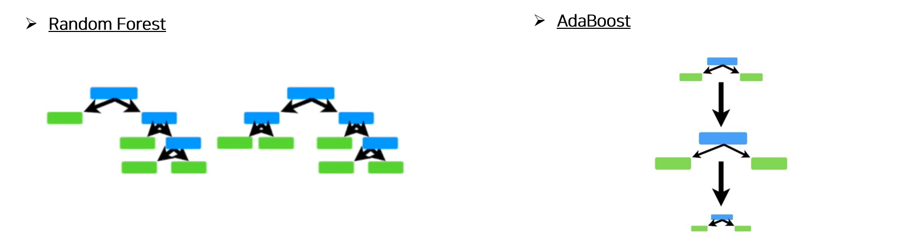
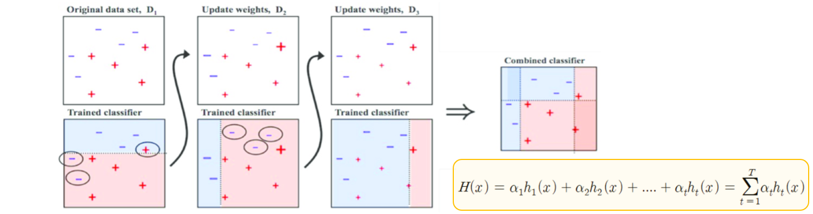
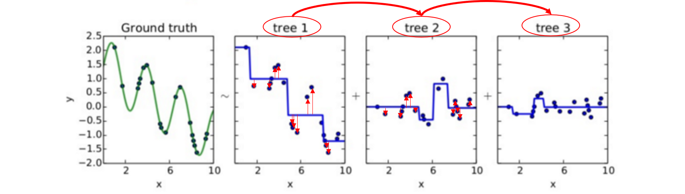
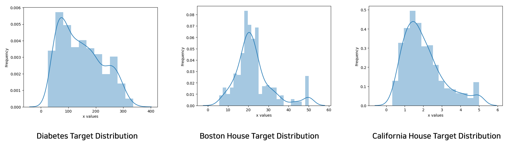

# 🤔Ensemble은 Imablanced Data에서도 효과를 보일까?

## The effect of ensemble learning in imbalanced regression datasets


🔥이번 Tutorial에서는 **Imbalanced Regression Dataset에서 Ensemble Learning이 효과**가 있을지에 대해서 Tutorial을 진행하고자 한다. 특히 Ensemble Learning기법 중 **Bagging을 사용하여 Deep Learning 모델**에서 효과성을 보고자 한다.


- 최근의 대부분의 SoTA 기법들은 Deep Learning기반으로 개발되어 지고 있다. Tabular Data는 아직 정복하지 못한 감이 있으나, 그것도 시간이 지남에 따라 점차적으로 해결되고 있다.

  - [[1908.07442\] TabNet: Attentive Interpretable Tabular Learning (arxiv.org)](https://arxiv.org/abs/1908.07442)
  - [[2106.11189\] Well-tuned Simple Nets Excel on Tabular Datasets (arxiv.org)](https://arxiv.org/abs/2106.11189)

- 그리고 Real-World의 Data들은 어떻게든 Imbalanced 한 Data를 갖는 경우가 대부분이다.

- 그러나 아직 Imbalanced Data 중 Regression Task에 대한 연구는 많이 이루어지지 않았으며, 최근 2021년부터 관련된 Deep Learning기반 Imbalanced Regression Task를 풀려하는 시도가 이루어지고 있다.

- 아직 Ensemble Learning을 통해 해당 Imbalanced Regression Task를 풀려는 시도는 극소수만 존재하며, 따라서 이번 Tutorial에서는 해당 Task에 Niave하게 Ensemble Learning을 적용해 보며 그 효과성에 대해서 생각 해 보고자 한다.

  - [REBAGG: REsampled BAGGing for Imbalanced Regression (mlr.press)](https://proceedings.mlr.press/v94/branco18a.html)

  


# Table of Contents

- [Background of Anomaly Detection](#Background-of-Ensemble-Learning)

  - [1. Basic Concept](#1-Basic-Concept)
  - [2. Bagging](#2-Bagging)
  - [3. Boosting](#3-Boosting)

- [Tutorial. Ensemble learning in imbalanced regression task](#Tutorial-Ensemble-learning-in-imbalanced-regression-task)

  - [1. Tutorial Notebook](#1-Tutorial-Notebook)
  - [2. Setting](#2-Setting)
  - [3. Usage Code](#3-Usage-Code)
  - [4. Result (Accuracy)](#4-Result_Accuracy)

- [Final Insights](#Final-Insights)

- [Conclusion](#Conclusion)

- [References](#References)

  

-------

# Background of Ensemble Learning

## 1. Basic Concept


단지 하나의 알고리즘이 모든 Dataset에 대해서, 모두 잘 동작되지는 않는다.(No Free Lunch) 왜냐하면 대부분의 알고리즘은 어떠한 현실에 대한 간략화 혹은 가정(Assumtion)을 기반으로 하는데, 이러한 가정은 특정 Case에는 잘 동작하지 않기 때문이다.


실제적으로 아래의 논문에서는 수백개의 Classifier들을 활용하여 우리가 원해 마지않는, Master Algorithm이 실제로는 존재하지 않다는 것을 Emirical한 Test로 밝혀 내었다.

- [Do we Need Hundreds of Classifiers to Solve Real World Classification Problems? (jmlr.org)](https://jmlr.org/papers/v15/delgado14a.html)


> 왜 우리가 만든 모델은 True Real Model로써 완벽히 잘 학습되지 않을까?

왜냐하면 실제 Data에는 항상 Noise가 존재하기 때문에 Machine Learning 모델이 항상 정확한 추정이 불가능하다. 또한 Population을 설명할 만큼의 Data Sample이 충분하지 않은 경우가 많고, Training Set과 Testing Set의 분포가 다른 등의 문제가 항상 존재한다.

특히나 Data상에 Noise가 존재하는 문제 상황에서, Machine Learning모델은 Model의 Complexity에 따라, 단순한(Simple) 모델은 Bias Error가 커지고, 복잡한(Complex) 모델은 Variance Error가 커지는 경향이 있다. 


- Bias (편향) Error
  - 반복 모델 학습 시, **평균적**으로 얼마나 정확한 추정이 가능한지 측정
  - **모델이 단순**하면, Bias가 커지는 경향

- Vriance (분산) Error
  - 반복 모델 학습 시, **개별 추정**이 얼마나 정확한 추정이 가능한지 측정
  - **모델이 복잡**하면, Variance가 커지는 경향


이러한 모델의 Complexity에 대응하고, 하나의 모델로 모든 Real-World의 Case를 대응하지 못하는 문제점을 해결하고자, 다양한 모델을 결합하여 사용하는 Ensemble Learning 기법이 등장하였다. Ensemble Learning의 핵심은 개별 모델들을 합쳐서 충분한 **모델의 다양성(Diversity)를 확보**하고, 그리고 다양한 개별 모델을 **어떻게 잘 결합 할지**에 대한 문제를 해결하고자 다양한 기법을 제시한다.


그리고 위에서 말한 Complexity에 따른 Bias과 Variance의 Error를 감소시키는 방식으로써, 아래의 3가지 분류로 Ensemble Learning은 분파를 나눌 수 있다. 이 중에 우리는 가장 많이 사용되는 Bagging과 Boosting에 대해 알아보겠다.


## 2. Bagging

분산(Variance) Error가 높고 편향(Bias) Error가 낮은 모델에 적합한, 즉 **Complexity가 높은 모델**(ex. ANN, SVM 등)에 적합한 방법인 Bagging을 간단히 알아보자. Bagging을 간단히 요약하자면, 데이터를 Split하여 모델의 차별화를 만들어내는 기법이라고 볼 수 있다.


Bagging은 사실 단순한 기법이다. 위의 그림처럼 단지 Data를 Sampling할때 Data의 Sample에 대한 방식을 다양하게 주어서, 모델의 Diversity를 높이는 방법이 전부이기 때문이다.(즉 Resampling기법이다.) 사실 Implicit하게 Ensemble Model을 만드는 방식인 Data Resampling Ensemble은 크게 2가지로 나뉜다. 하나는 비복원 추출방식인 **Pasting**이고, 다른 하나는 복원추출 방식인 **Bagging**이다. 이번에는 우리는 Bagging에 집중해서 스터디 해보겠다.


Bagging기법은 모델과 상관없이 진행될 수 있는 기법이며, 즉 어떠한 Complexity가 높은 모델에도 사용할 수 있다. 따라서 Deep Learning 모델에서 활용하기 용이하며, 이번 Tutorial에서도 Deep Learning모델을 활용하므로, Bagging 기법을 사용하여 진행할 예정이다.


> 이름은 들어봤겠지? 대표적 Bagging 알고리즘인 Random Forests

유명한 Bagging기반 알고리즘으로는 Random Forests가 있다. 아래와 같이 Depth가 있는(즉, Complexity를 높인) Tree들을 여러개 사용하여 Data를 Bagging을 통해 각 모델을 학습하는 기법이다.


추가적으로는 아래 그림의 우측과같이, Tree를 분기할 때 Random Feature Selection을 통해 모델의 다양성을 추가적으로 가져가게 된다. 개념적으로는 단순한데, Tabular Dataset에 대하여 매우 좋은 성능을 가져갈 수 있는 방법 중 하나이다.


또한 Bagging의 장점은, 단지 Data Sampling에 대한 문제이기 때문에, 개별 모델들을 Parallel하게 병렬적으로 학습할 수 있다는 장점이 있다. 즉 Multi-Processing환경에서는 다른 Ensemble 기법보다 우월한 성능 향상을 가져갈 수 있다.


## 3. Boosting

두번째로는 분산(Variance) Error가 낮고 편향(Bias) Error가 높은 모델에 적합한, 즉 **Complexity가 낮은 모델**(ex. Decision Stump등)에 적합한 방법인 Boosting을 간단히 알아보자. Boosting을 간단히 요약하자면, Sequential하게 각각의 모델들을 하나씩 학습해 나가며, 이전 모델에서 예측이 잘 안되는 것을 다음 모델이 추가적으로 학습해 나가는 방법이라고 볼 수 있다. Boosting도 여러 알고리즘을 통해 구현이 가능하지만, Bagging과는 조금 달리 특정 알고리즘을 가리키는 경우가 많이 있다. (ex. Adaboost, XGBoost, LightGBM 등)


### AdaBoost (Adaptive Boosting)


의미있는 결과를 내놓은 거의 최초의 Boosting 기법이다. Viola-Jones Real-Time Object Detector에 사용되고 있고, 말 그대로 Real-Time으로 작동될 정도로 속도가 빠른 기법이다. 보통 Decision Tree를 간단히 만든 Decision Stump로 만들고, Random Forests는 조금 큰 Decision Tree를 사용한다면, AdaBoost는 아주 단순한 1-depth의 Decision Stump를 아래와 같이 사용한다. 




AdaBoost는 Sequential한 분류 알고리즘으로써, 이전 분류기가 잘 못 분류한 것들에 Weight를 더 주어, 그것들에 집중하여 학습하도록 하는 기법이다. 아래의 Sequence에 따라 알고리즘이 동작하며, Step 1~3을 반복하다가 Convergence되면 최종 선형 Weighted Sum으로 결과를 Aggregating하여 사용하는 알고리즘이다.

- Step 1. 현재 Dataset에 대하여 단순한 모델을 사용해 학습
- Step 2. Training Error가 큰 Data 객체의 선택 확률을 증가, Error가 작은 개체의 선택확률 감소
- Step 3. ‘Step 2’의 계산된 확률을 사용하여 다음 단계의 Dataset 구성
- 최종 Aggregation은 각 모델의 성능 지표를 Weight로 사용하여 결합

알고리즘의 학습 과정을 그림으로 나타내면 아래와 같다. 오분류된 결과는 좀 더 큰 Weight $\alpha$를 갖게 된다.




### GBM (Gradient Boosting Machine)

GBM은 이전 모델에서 예측한 값과 정답값 사이의 오차인 Gradient(혹은 Residual로 표현)를 다음 모델이 학습해 가는 Sequential한 Boosting알고리즘이다. XGBoost, LightGBM 등의 근간이 되는 기본적인 알고리즘이라고 볼 수 있다.


아래의 그림과 같이, 첫번째 Tree모델이 Ground Truth에 대한 학습을 하고, 정답값과의 Residual(Gradient)를 계산하여, 그 Residual만큼 Tree 2가 학습한다. 마찬가지로 Tree 3도 Tree 2의 Residual을 계산하여 학습해 나간다. 이를 반복해서 만든 모델이 바로 Gradient Boosting Machine이다.



아주 단순하지만 강력한 모델이다. 그러나 단점으로는 아무래도 작은 모든 Residual을 계산하여 학습하다 보니, Noise까지 학습되는 경향이 있어 Overfitting에 취약하다고 할 수 있겠다.


### XGBoost (Extreme Gradient Boosting Machine)


Gradient Boosting은 위의 GBM의 **Overfitting을 방지하는 몇가지 Regularization 기법**을 사용하도록 개발된 알고리즘이다. 또한 속도를 높이기 위해 Cache Hit Optimization이나 Data Split Finding Algorithm등을 활용하여 고속의 연산을 수행하도록 한다.

일단 우리는 **알고리즘의 속도 적인 측면보다는 알고리즘의 성능적인 측면**에서 Overfitting을 막는 기법이 학문적으로 더 중요하므로 그 부분을 간단히 살펴 보고자 한다.

크게 아래와 같이 2가지 방법을 사용하여 Ovefitting을 방지하려 하고 있다.


> 1. Regularized Learning Objective 

일반 GBM은 단순이 MSE를 Loss Function으로 사용하는데, XGBoost는 아래와 같이 REgularized Term을 사용하여 Overfitting을 방지한다. 여기서 Ω 는 leaf의 개수인 T가 적고, ||w||^2가 작도록(leaf의 L2 norm이 작은) 하는 방향으로 학습을 유도해 준다.


>  2. Shrinkage and Column Subsampling 

**Shrinkage** : 부스팅 트리의 각 단계 이후 마다 새롭게 추가된 가중치 η로 Scaling 함. Stochastic 최적화의 Learning rate와 유사하게 개별 트리의 영향도를 감소하고 미래 트리 공간을 남겨 놓음 

**Column (Feature) Subsampling** :모든 Feature를 사용하는 것이 아닌 일부 Feature만을 사용하여 다양성을 부여하고 Overfitting을 방지


----

# Tutorial. Ensemble learning in imbalanced regression task

이번 튜토리얼에서는 Ensemble Learning 기법 중 Bagging을 사용하여 Complexity가 높은 모델인 DNN을 기반하여 Imbalanced Regression Task에 대한 학습을 수행하려한다. 이때 Few Shot과 Many Shot에 대하여 Accuracy를 비교하여 과연 Few Shot에 대한 Imbalanced Data에 Regression 성능이 Ensemble로 높아지는지 확인해 보려 한다. 또한 일반적인 Bagging에 추가적으로 Imbalanced Regression기법 중 하나인 REBAGG(Resampling Bagging) 기법을 적용하여 성능의 변화를 확인해 보고자 한다.


## 1. Tutorial Notebook 

### 🔥[Go to the tutorial notebook](https://github.com/Shun-Ryu/business_analytics_tutorial/blob/main/3_anomaly_detection/Tutorials/tutorial_anomaly_detection_from_R_task.ipynb)


## 2. Setting

### Datasets

데이터셋은 아래와 같이 3개의 유명한 Tabular 형태의 Regression Dataset을 사용한다. 전체 데이터 중 Training Set은 64%, Validation Set은 16%, Test Set은 20%의 Data비율로 나누었다.

|      | Datasets                            | Description                                                  | Num Instances | Num Inputs (Xs) | Num Outputs (Ys) |
| ---- | ----------------------------------- | ------------------------------------------------------------ | ------------- | --------------- | ---------------- |
| 1    | Diabetes (Regression)               | 당뇨병 환자 데이터 (1년 후 당뇨의 진행정도를 Target값으로 함) | 442           | 10              | 1                |
| 2    | Boston House Price (Regression)     | Boston의 집값에 대한 Data                                    | 506           | 13              | 1                |
| 3    | California House Price (Regression) | California 집값에 대한 Data                                  | 20,640        | 8               | 1                |

데이터셋은 아래와 같은 코드로 불러오게 된다.

```python
# dataset_name = 'diabetes'
dataset_name = 'california_house'
# dataset_name = 'boston_house'

if dataset_name == 'diabetes':
    x, y= datasets.load_diabetes(return_X_y=True)
    threshold_rare = 270
    EPOCHS = 3500
    TRAIN_BATCH = 2048
elif dataset_name == 'california_house':
    data = datasets.fetch_california_housing()
    x = data.data
    y = data.target
    threshold_rare = 3.5
    EPOCHS = 800
    TRAIN_BATCH = 4096 
elif dataset_name == 'boston_house':
    data_url = "http://lib.stat.cmu.edu/datasets/boston"
    raw_df = pd.read_csv(data_url, sep="\s+", skiprows=22, header=None)
    x = np.hstack([raw_df.values[::2, :], raw_df.values[1::2, :2]])
    y = raw_df.values[1::2, 2]

    threshold_rare = 35
    EPOCHS = 3500
    TRAIN_BATCH = 2048


```

불러진 3개의 Dataset에 대한 Y값의 Sampling 분포는 아래와 같다. 특별히 Imbalanced Dataset을 고른 것도 아니지만. 모든 데이터가 왼쪽으로 Skew가 된, Right-Side Long-tailed Regression Problem이라는 것을 알 수 있다.




각 Regression Task에서 Imbalanced Regression의 정확도를 구하기 위하여, Many shot과 Few Shot으로 데이터셋을 나누어 계산하려 한다. 따라서 아래와 같은 Threshold값을 통해 데이터를 2가지 형태로 구분하고, 각각의 구분된 Many shot과 Few shot의 정확도를 L1 Loss로 구하게 된다.

- **Diabetes : 270** 
- **Boston House Price : 35**
- **California House Price : 3.5**

이러한 수치를 구하는 것을 SMOTE, SMOGN 등의 기법들을 구현하 저자들은 Relevance Function을 구하여 정하게 되는데, 사실 특별한 차이는 없기 떄문에, 간단히 Constant Threshold로 Many Shot과 Few Shot으로 구분 하였다. 최근의 Imbalanced Regression Task 논문들에서도 위와 유사하게 진행한다.


### Algorithms

아래와 같은 3가지 종류의 알고리즘을 사용하여 진행하였다.

|      | Algorithm                                      | Target     | Description                                                  |
| ---- | ---------------------------------------------- | ---------- | ------------------------------------------------------------ |
| 1    | MLP                                            | Regression | 2개의 Hidden Layer로 구성된 MLP Layer                        |
| 2    | Ensemble MLP                                   | Regression | 위의 1번 모델과 완전히 동일한 MLP Layer를 6개 Ensemble한 모델 |
| 3    | Ensemble MLP with REBAGG (Random Oversampling) | Regression | 2번의 Ensemble MLP에 각 Model별 Random Oversampling을 적용한 기법 |


## 3. Usage Code

### MLP

2개의 Hidden Layer와 Input, Output Layer를 가진 간단한 MLP구조를 Main Model로 사용하였다. 기본적으로 Dropout과 Batchnormalization 등의 기법을 사용하여 Regularization을 하였으며, Overfitting전에 Validation Set으로 결정된 Best Model을 중간중간 저장하기 때문에 사실 해당 MLP모델은 Variance Error를 많이 줄여둔 상태라고도 볼 수 있다. 특히나 Dropout같은 경우 0.5 정도로 크게 걸어주었기 때문에, Dropout이 Ensemble과 유사한 효과를 낼 수 있이므로, 한번 이 상태에서 Ensemble의 효과가 과연 추가적으로 있을지 보도록 하자.


> Model Code

```python
BATCH_SIZE = 2048 
LEARNING_RATE = 0.001

NUM_INPUT = x_train.shape[1]
NUM_OUTPUT = 1 
NUM_1ST_HIDDEN = 32 
NUM_2ND_HIDDEN = 16 
NUM_1ST_DROPOUT = 0.6
NUM_2ND_DROPOUT = 0.5

class BasicRegressor(nn.Module):
    def __init__(self) -> None:
        super(BasicRegressor, self).__init__()

        self.layer_1 = nn.Linear(NUM_INPUT, NUM_1ST_HIDDEN)
        self.layer_2 = nn.Linear(NUM_1ST_HIDDEN, NUM_2ND_HIDDEN)
        self.layer_out = nn.Linear(NUM_2ND_HIDDEN, NUM_OUTPUT)

        # self.actvation = nn.ReLU()
        self.actvation_1 = nn.ReLU()
        self.actvation_2 = nn.ReLU()
        self.dropout_1 = nn.Dropout(p=NUM_1ST_DROPOUT)
        self.dropout_2 = nn.Dropout(p=NUM_2ND_DROPOUT)
        self.batchnorm_1 = nn.BatchNorm1d(NUM_1ST_HIDDEN)
        self.batchnorm_2 = nn.BatchNorm1d(NUM_2ND_HIDDEN)
    
    def forward(self, inputs):
        x = self.actvation_1(self.layer_1(inputs))
        x = self.batchnorm_1(x)
        x = self.dropout_1(x)
        x = self.actvation_2(self.layer_2(x))
        x = self.batchnorm_2(x)
        x = self.dropout_2(x)
        x = self.layer_out(x)

        return x

device = torch.device("cuda:0" if torch.cuda.is_available() else "cpu")
print(device)

```


> Training Code

학습은 굉장히 단순하다. 하나의 모델을 학습을 진행하면 끝난다. :) 

```python
num_train_data = len(train_loader)
num_eval_data = len(valid_loader)


elapsed_time_basic_ann = []

start_time = datetime.now()


best_model = train_model(num_train_data, num_eval_data)


elapsed_time_basic_ann.append((datetime.now()-start_time).total_seconds())
```


> Inference Code

Inference도 굉장히 단순하다. 저장된 Best Model 1개로 Test Dataset에 대해 Evaluation하고, 그에 대한 개별 Loss를 구한다. (Few Shot과 Many Shot에 대한 개별적 L1 Loss를 계산함)

```python
best_model.eval()
data = torch.from_numpy(x_test).float().to(device)
answer = torch.from_numpy(y_test).float().to(device)

start_time = datetime.now()
output = best_model(data)
loss_basic_ann = calc_loss(output, answer)
elapsed_time_basic_ann.append((datetime.now()-start_time).total_seconds())

print('elapsed time ', elapsed_time_basic_ann)
```


### Ensemble MLP

Ensemble MLP의 경우는 위의 MLP 모델과 동일한 구조를 가져간다. 단지 학습할 시에, NUM_ENSEMBLE_MODELS에 들어있는 Integer Value에 따라서, Bagging의 개수를 정할 수 있다. 아래의 예제는 6개의 Ensemble Learning을 진행하며, 각각의 Best Model을 저장하는 Training Code이다. 저장된 모델들은 best_models라는 list에 저장된다.

> Training Code

```python
NUM_ENSEMBLE_MODELS = 6 # or 3

best_models = []
for i in range(NUM_ENSEMBLE_MODELS):
    model = BasicRegressor()
    model.to(device)

    # criterion = nn.L1Loss()
    criterion = nn.MSELoss()
    optimizer = optim.Adam(model.parameters(), lr=LEARNING_RATE)

    bagg_indices = np.random.choice(range(len(x_train)), len(x_train), replace=True)

    x_train_bagg = x_train[bagg_indices, :]
    y_train_bagg = y_train[bagg_indices, :]
    # train_data = TrainData(torch.FloatTensor(x_train), torch.FloatTensor(y_train))
    train_data = TrainData(torch.FloatTensor(x_train_bagg), torch.FloatTensor(y_train_bagg))
    train_loader = DataLoader(dataset=train_data, batch_size=2048, shuffle=True)


    num_train_data = len(train_loader)
    num_eval_data = len(valid_loader)


    elapsed_time_basic_ann = []
    start_time = datetime.now()

    best_model = train_model(num_train_data, num_eval_data)

    best_models.append(best_model)


```


> Inference Code

아래의 코드는 Ensemble을 Aggregation하는 코드이다. 단순히 모델들의 Prediction을 Average하여 Regression Output값으로 사용하였다. Bagging이므로 이러한 방식이 합리적이라고 생각한다.

```python
# inference
sum_output = np.zeros(y_test.shape)

for best_model in best_models:
    best_model.eval()
    output = best_model(data)
    sum_output += output.cpu().detach().numpy()

avg_output = sum_output / len(best_models)
```


### Ensemble MLP with REBAGG

해당 방법은 Ensemble을 해서 학습할 때, Data를 단순히 Bagging하여 Replacement Sampling만 적용하는 것이 아니라, Rare(Few Shot)와 Normal(Many Shot)에 대한 Threshold를 기반으로, Rare Label을 더 많이 Random Oversampling을 하면서 각 Ensemble의 Module을 학습하는 기법이다. 굉장히 단순한 기법이며, Random Oversampling외에 Undersampling, Gaussian Noise Adding, SMOGN 등의 여러 데이터 Over/Under Sampling을 결합해서 사용할 수 있다. (사실 개인적으로 SMOTE계열 방법들은 선호하지는 않는다.)


> Training Code

```python
rare_indicies = np.where(y_train>threshold_rare)[0]
normal_indicies = np.where(y_train<=threshold_rare)[0]

ov_rare_indicies = np.random.choice(range(len(rare_indicies)), len(normal_indicies), replace=True)

x_train_normal_bagg = x_train[normal_indicies, :]
y_train_normal_bagg = y_train[normal_indicies, :]


x_train_rare_bagg = x_train[ov_rare_indicies, :]
y_train_rare_bagg = y_train[ov_rare_indicies, :]


best_models = []
for i in range(NUM_ENSEMBLE_MODELS):
    model = BasicRegressor()
    model.to(device)

    # criterion = nn.L1Loss()
    criterion = nn.MSELoss()
    optimizer = optim.Adam(model.parameters(), lr=LEARNING_RATE)

    bagg_indices = np.random.choice(range(len(x_train)), len(x_train), replace=True)
    # x_train_bagg = x_train[bagg_indices, :]
    # y_train_bagg = y_train[bagg_indices, :]

    rare_indicies = np.where(y_train>threshold_rare)[0]
    normal_indicies = np.where(y_train<=threshold_rare)[0]

    ov_rare_indicies = np.random.choice(range(len(rare_indicies)), len(normal_indicies), replace=True)

    x_train_normal_bagg = x_train[normal_indicies, :]
    y_train_normal_bagg = y_train[normal_indicies, :]


    x_train_rare_bagg = x_train[rare_indicies, :]
    y_train_rare_bagg = y_train[rare_indicies, :]


    x_train_total_bagg = np.append(x_train_normal_bagg, x_train_rare_bagg, axis=0)
    y_train_total_bagg = np.append(y_train_normal_bagg, y_train_rare_bagg, axis=0)

    

    
    # train_data = TrainData(torch.FloatTensor(x_train), torch.FloatTensor(y_train))
    train_data = TrainData(torch.FloatTensor(x_train_total_bagg), torch.FloatTensor(y_train_total_bagg))
    train_loader = DataLoader(dataset=train_data, batch_size=2048, shuffle=True)


    num_train_data = len(train_loader)
    num_eval_data = len(valid_loader)


    elapsed_time_basic_ann = []
    start_time = datetime.now()

    best_model = train_model(num_train_data, num_eval_data)

    best_models.append(best_model)


```


> Inference Code

Training에만 다르지, Inference는 단순 Ensemble Learning과 동일하다. best_models에 저장된 모델들을 여러 Ensemble로 예측해 주고 Output을 Average해 준다.

```python
# inference
sum_output = np.zeros(y_test.shape)

for best_model in best_models:
    best_model.eval()
    output = best_model(data)
    sum_output += output.cpu().detach().numpy()

avg_output = sum_output / len(best_models)
```


## 4. Result_Accuracy

- 측정 단위 : MAE (Mean Absolute Error)
- Dataset은 Testset 20%, Training 64%, Validation 16%를 기준으로 진행하였다.
- Accuracy는 Testset에 대해서만 계산하였다. (당연히!)
- 모델은 Validation 기준으로 Loss가 가장 적은 Best Model로 Testing을 진행함
- 3개의 Dataset에 대한 각각의 Loss는 3가지로 구분된다.
  - 전체의 Average(Avg)
  - Normal Distribution(Many Shot)
  - Rare Distribution(Few Shot)


|      | Algorithm                     | Diabetes (Avg) | Diabetes (Many Shot) | Diabetes (Few Shot) | Boston House (Avg) | Boston House (Many Shot) | Boston House (Few Shot) | California House (Avg) | California House (Many Shot) | California House (Few Shot) |
| ---- | ----------------------------- | -------------- | -------------------- | ------------------- | ------------------ | ------------------------ | ----------------------- | ---------------------- | ---------------------------- | --------------------------- |
| 1    | MLP                           | 46.90          | 39.84                | 92.18               | 2.60               | 2.07                     | 8.09                    | 0.44                   | **0.36**                     | 1.00                        |
| 2    | Ensemble MLP (x3)             | **43.24**      | **36.47**            | **86.55**           | **2.41**           | 1.99                     | **6.71**                | 0.44                   | 0.37                         | **0.93**                    |
| 3    | Ensemble MLP with REBAGG (x3) | 44.35          | 37.38                | 89.11               | 2.59               | 2.10                     | 7.64                    | 0.44                   | **0.36**                     | 1.00                        |
| 4    | Ensemble MLP (x6)             | 43.88          | 36.60                | 90.60               | 2.50               | 2.06                     | 7.07                    | 0.44                   | 0.37                         | 0.94                        |
| 5    | Ensemble MLP with REBAGG (x6) | 44.70          | 37.66                | 89.92               | 2.42               | **1.96**                 | 7.11                    | 0.44                   | 0.37                         | 0.95                        |


----


# Final Insights


# Conclusion

- Anoamaly Detection은 그 한계성도 분명히 있으므로, 무지성으로 쉽게 바로 사용하지 말고, 각 문제가 갖고 있는 근본적인 상황을 고려하여 적합한 알고리즘을 잘 적용을 해야 한다.


-----

# References

-  고려대학교 산업경영공학부 강필성 교수님 Business Analytics 강의 자료
- https://towardsdatascience.com/ensemble-learning-bagging-boosting-3098079e5422
- [ZhiningLiu1998/imbalanced-ensemble: Class-imbalanced / Long-tailed ensemble learning in Python. Modular, flexible, and extensible. | 模块化、灵活、易扩展的类别不平衡/长尾机器学习库 (github.com)](https://github.com/ZhiningLiu1998/imbalanced-ensemble)
- [Imbalanced Classification | Handling Imbalanced Data using Python (analyticsvidhya.com)](https://www.analyticsvidhya.com/blog/2020/07/10-techniques-to-deal-with-class-imbalance-in-machine-learning/)
- [Ensemble Methods - Overview, Categories, Main Types (corporatefinanceinstitute.com)](https://corporatefinanceinstitute.com/resources/data-science/ensemble-methods/)
- [Random Forest vs Xgboost | MLJAR](https://mljar.com/machine-learning/random-forest-vs-xgboost/)
