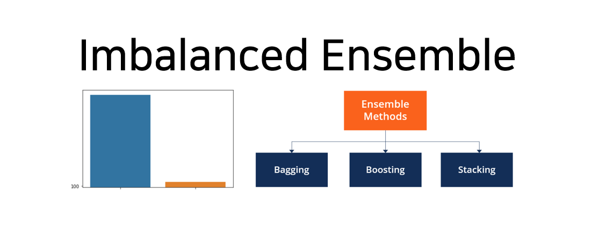
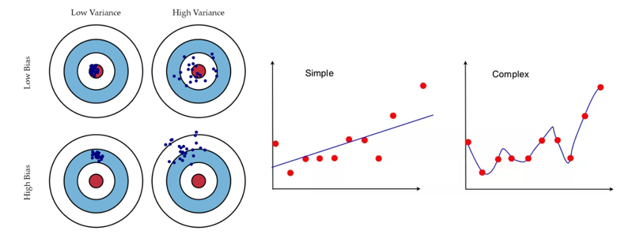
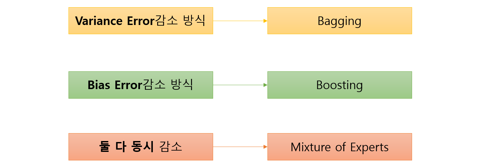
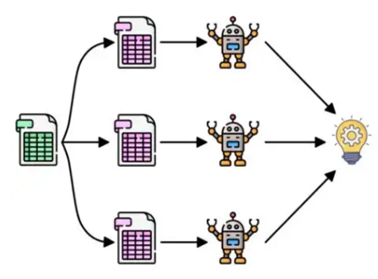
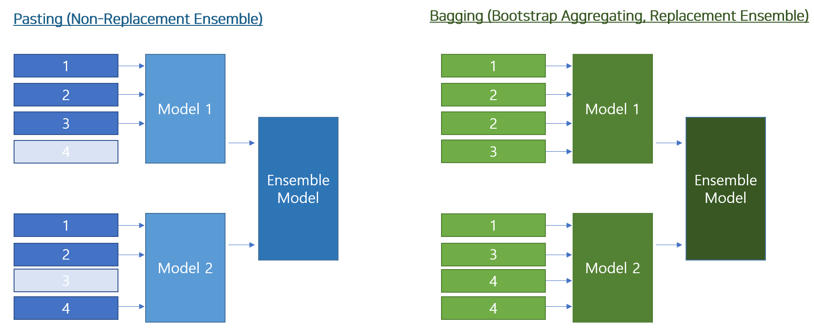
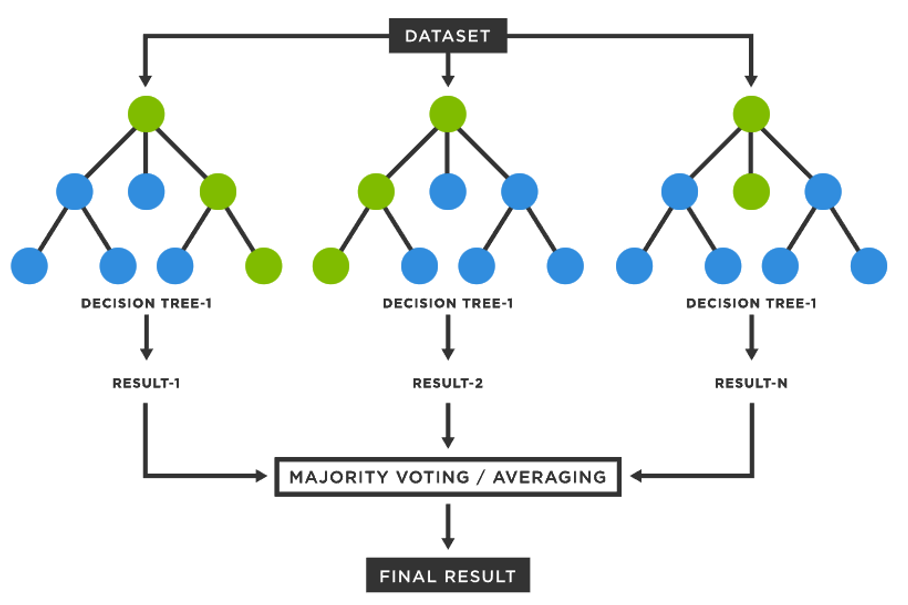
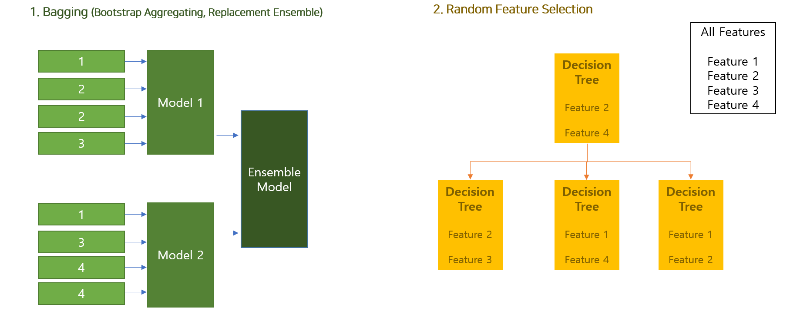
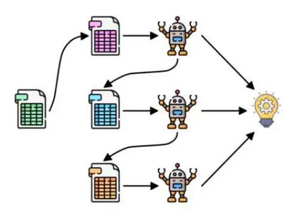

# 🤔Ensemble은 Imablanced Data에서도 효과를 보일까?

## The effect of ensemble learning in imbalanced regression datasets




🔥이번 Tutorial에서는 **Imbalanced Regression Dataset에서 Ensemble Learning이 효과**가 있을지에 대해서 Tutorial을 진행하고자 한다. 특히 Ensemble Learning기법 중 **Bagging을 사용하여 Deep Learning 모델**에서 효과성을 보고자 한다.


- 최근의 대부분의 SoTA 기법들은 Deep Learning기반으로 개발되어 지고 있다. Tabular Data는 아직 정복하지 못한 감이 있으나, 그것도 시간이 지남에 따라 점차적으로 해결되고 있다.

  - [[1908.07442\] TabNet: Attentive Interpretable Tabular Learning (arxiv.org)](https://arxiv.org/abs/1908.07442)
  - [[2106.11189\] Well-tuned Simple Nets Excel on Tabular Datasets (arxiv.org)](https://arxiv.org/abs/2106.11189)

- 그리고 Real-World의 Data들은 어떻게든 Imbalanced 한 Data를 갖는 경우가 대부분이다.

- 그러나 아직 Imbalanced Data 중 Regression Task에 대한 연구는 많이 이루어지지 않았으며, 최근 2021년부터 관련된 Deep Learning기반 Imbalanced Regression Task를 풀려하는 시도가 이루어지고 있다.

- 아직 Ensemble Learning을 통해 해당 Imbalanced Regression Task를 풀려는 시도는 극소수만 존재하며, 따라서 이번 Tutorial에서는 해당 Task에 Niave하게 Ensemble Learning을 적용해 보며 그 효과성에 대해서 생각 해 보고자 한다.

  - [REBAGG: REsampled BAGGing for Imbalanced Regression (mlr.press)](https://proceedings.mlr.press/v94/branco18a.html)

  


# Table of Contents

- [Background of Anomaly Detection](#Background-of-Anomaly-Detection)

  - [1. Basic Concept](#1-Basic-Concept)
  - [2. One-Class SVM](#2-One-Class-SVM)
  - [3. Isolation Forest](#3-Isolation-Forest)
  - [4. Auto-Encoder for Anomaly Detection](#4-Auto-Encoder-for-Anomaly-Detection)
  - [5. Mixture of Gaussian](#5-Mixture-of-Gaussian)

- [Tutorial 1. Regression To Anomaly Detection](#Tutorial-1-Regression-To-Anomaly-Detection)

  - [1-1. Tutorial Notebook](#1-1-Tutorial-Notebook)
  - [1-2. Setting](#1-2-Setting)
  - [1-3. Usage Code](#1-3-Usage-Code)
  - [1-4. Result (Accuracy)](#1-4-Result_Accuracy)

- [Tutorial 2. Classification To Anomaly Detection](#Tutorial-2-Classification-To-Anomaly-Detection)

  - [2-1. Tutorial Notebook](#2-1-Tutorial-Notebook)
  - [2-2. Setting](#2-2-Setting)
  - [2-3. Usage Code](#2-3-Usage-Code)
  - [2-4. Result (Accuracy)](#2-4-Result_Accuracy)

- [Final Insights](#Final-Insights)

  - [1. Regression To Anomaly Detection](#1-Regression-To-Anomaly-Detection)
  - [2. Classification To Anomaly Detection](#2-Classification-To-Anomaly-Detection)
  - [3. Conclusion](#3-Conclusion)

- [References](#References)

  

-------

# Background of Ensemble Learning

## 1. Basic Concept


단지 하나의 알고리즘이 모든 Dataset에 대해서, 모두 잘 동작되지는 않는다.(No Free Lunch) 왜냐하면 대부분의 알고리즘은 어떠한 현실에 대한 간략화 혹은 가정(Assumtion)을 기반으로 하는데, 이러한 가정은 특정 Case에는 잘 동작하지 않기 때문이다.


실제적으로 아래의 논문에서는 수백개의 Classifier들을 활용하여 우리가 원해 마지않는, Master Algorithm이 실제로는 존재하지 않다는 것을 Emirical한 Test로 밝혀 내었다.

- [Do we Need Hundreds of Classifiers to Solve Real World Classification Problems? (jmlr.org)](https://jmlr.org/papers/v15/delgado14a.html)


> 왜 우리가 만든 모델은 True Real Model로써 완벽히 잘 학습되지 않을까?

왜냐하면 실제 Data에는 항상 Noise가 존재하기 때문에 Machine Learning 모델이 항상 정확한 추정이 불가능하다. 또한 Population을 설명할 만큼의 Data Sample이 충분하지 않은 경우가 많고, Training Set과 Testing Set의 분포가 다른 등의 문제가 항상 존재한다.

특히나 Data상에 Noise가 존재하는 문제 상황에서, Machine Learning모델은 Model의 Complexity에 따라, 단순한(Simple) 모델은 Bias Error가 커지고, 복잡한(Complex) 모델은 Variance Error가 커지는 경향이 있다. 




- Bias (편향) Error
  - 반복 모델 학습 시, **평균적**으로 얼마나 정확한 추정이 가능한지 측정
  - **모델이 단순**하면, Bias가 커지는 경향

- Vriance (분산) Error
  - 반복 모델 학습 시, **개별 추정**이 얼마나 정확한 추정이 가능한지 측정
  - **모델이 복잡**하면, Variance가 커지는 경향


이러한 모델의 Complexity에 대응하고, 하나의 모델로 모든 Real-World의 Case를 대응하지 못하는 문제점을 해결하고자, 다양한 모델을 결합하여 사용하는 Ensemble Learning 기법이 등장하였다. Ensemble Learning의 핵심은 개별 모델들을 합쳐서 충분한 **모델의 다양성(Diversity)를 확보**하고, 그리고 다양한 개별 모델을 **어떻게 잘 결합 할지**에 대한 문제를 해결하고자 다양한 기법을 제시한다.


그리고 위에서 말한 Complexity에 따른 Bias과 Variance의 Error를 감소시키는 방식으로써, 아래의 3가지 분류로 Ensemble Learning은 분파를 나눌 수 있다. 이 중에 우리는 가장 많이 사용되는 Bagging과 Boosting에 대해 알아보겠다.




## 2. Bagging

분산(Variance) Error가 높고 편향(Bias) Error가 낮은 모델에 적합한, 즉 **Complexity가 높은 모델**(ex. ANN, SVM 등)에 적합한 방법인 Bagging을 간단히 알아보자. Bagging을 간단히 요약하자면, 데이터를 Split하여 모델의 차별화를 만들어내는 기법이라고 볼 수 있다.




Bagging은 사실 단순한 기법이다. 위의 그림처럼 단지 Data를 Sampling할때 Data의 Sample에 대한 방식을 다양하게 주어서, 모델의 Diversity를 높이는 방법이 전부이기 때문이다.(즉 Resampling기법이다.) 사실 Implicit하게 Ensemble Model을 만드는 방식인 Data Resampling Ensemble은 크게 2가지로 나뉜다. 하나는 비복원 추출방식인 **Pasting**이고, 다른 하나는 복원추출 방식인 **Bagging**이다. 이번에는 우리는 Bagging에 집중해서 스터디 해보겠다.




Bagging기법은 모델과 상관없이 진행될 수 있는 기법이며, 즉 어떠한 Complexity가 높은 모델에도 사용할 수 있다. 따라서 Deep Learning 모델에서 활용하기 용이하며, 이번 Tutorial에서도 Deep Learning모델을 활용하므로, Bagging 기법을 사용하여 진행할 예정이다.


> 이름은 들어봤겠지? 대표적 Bagging 알고리즘인 Random Forests

유명한 Bagging기반 알고리즘으로는 Random Forests가 있다. 아래와 같이 Depth가 있는(즉, Complexity를 높인) Tree들을 여러개 사용하여 Data를 Bagging을 통해 각 모델을 학습하는 기법이다.




추가적으로는 아래 그림의 우측과같이, Tree를 분기할 때 Random Feature Selection을 통해 모델의 다양성을 추가적으로 가져가게 된다. 개념적으로는 단순한데, Tabular Dataset에 대하여 매우 좋은 성능을 가져갈 수 있는 방법 중 하나이다.




또한 Bagging의 장점은, 단지 Data Sampling에 대한 문제이기 때문에, 개별 모델들을 Parallel하게 병렬적으로 학습할 수 있다는 장점이 있다. 즉 Multi-Processing환경에서는 다른 Ensemble 기법보다 우월한 성능 향상을 가져갈 수 있다.


## 3. Boosting

두번째로는 분산(Variance) Error가 낮고 편향(Bias) Error가 높은 모델에 적합한, 즉 **Complexity가 낮은 모델**(ex. Decision Stump등)에 적합한 방법인 Boosting을 간단히 알아보자. Boosting을 간단히 요약하자면, Sequential하게 각각의 모델들을 하나씩 학습해 나가며, 이전 모델에서 예측이 잘 안되는 것을 다음 모델이 추가적으로 학습해 나가는 방법이라고 볼 수 있다. Boosting도 여러 알고리즘을 통해 구현이 가능하지만, Bagging과는 조금 달리 특정 알고리즘을 가리키는 경우가 많이 있다. (ex. Adaboost, XGBoost, LightGBM 등)




----

# Tutorial. Ensemble learning in imbalanced regression task

이번 튜토리얼에서는 앞서 설명한 것과 같이 근본적으로 Regression인 Task를 Threshold를 통해 Anomaly Detection (일종의 One-Class Binary Classification)이 가능할지 알아보는 실험이다. 해당 실험을 위해 우리는 하나의 Regression(SVR)과 여러 Anomaly Detection 알고리즘의 성능을 비교 하고자 한다.


위와 같은 Logistic Regression이 아마 유사한 개념이라고 볼 수 있다. Regression 결과(Logit)를 확률로 변환하여(Logistic), 0.5라는 Threshold로 나눠서 Classification을 하는 것과 유사한 개념으로 Regression을 사용해 Threshold하여 Classification을 하는 아주 직관적인 방법과 Anomaly Detection의 비교라고 이해하면 되겠다.


## 1. Tutorial Notebook 

### 🔥[Go to the tutorial notebook](https://github.com/Shun-Ryu/business_analytics_tutorial/blob/main/3_anomaly_detection/Tutorials/tutorial_anomaly_detection_from_R_task.ipynb)


## 2. Setting

### Datasets

데이터셋은 아래와 같이 2개의 유명한 Tabular 형태의 Regression Dataset을 사용한다. 두개의 Dataset모두 Regression Target이므로 Thresholding을 통해 목적에 맞게 수정하여 사용한다. 전체 데이터 중 Training Set은 64%, Validation Set은 16%, Test Set은 20%의 Data비율로 나누었다.

|      | Datasets                        | Description                                                  | Num Instances | Num Inputs (Xs) | Num Outputs (Ys) |
| ---- | ------------------------------- | ------------------------------------------------------------ | ------------- | --------------- | ---------------- |
| 1    | Diabetes (Regression)           | 당뇨병 환자 데이터 (1년 후 당뇨의 진행정도를 Target값으로 함) | 442           | 10              | 1                |
| 2    | Boston House Price (Regression) | Boston의 집값에 대한 Data                                    | 506           | 13              | 1                |

데이터셋은 아래와 같은 코드로 불러오게 된다.

```python
if dataset_name == 'diabetes_r':
    x, y= datasets.load_diabetes(return_x_y=true)
elif dataset_name == 'boston_r':
    data_url = "http://lib.stat.cmu.edu/datasets/boston"
    raw_df = pd.read_csv(data_url, sep="\s+", skiprows=22, header=none)
    x = np.hstack([raw_df.values[::2, :], raw_df.values[1::2, :2]])
    y = raw_df.values[1::2, 2]
else:
    pass
```

각 Dataset은 Regression Target이므로, 각 Dataset을 Anomaly에 사용하기 위하여 사용되는 Threshold값은 아래와 같다. 각 값은 전체 데이터의 Median 값이다. Regression Task에 Imbalanced에 의한 영향을 줄이기 위해 중앙값을 사용하여 양불 Data의 Balance를 맞추었다.

- **Diabetes : 140** 
- **Boston House Price : 21**


### Algorithms

알고리즘은 아래와 Regression 알고리즘과 Anomaly Detection을 서로 비교한다.

- Regerssion 
  - SVR을 사용하여 Regression Task에서 Regression Algorithm을 사용하고 예측한 값을 특정 Threshold로 Classification하여 양불을 판정하는데 사용한다.
- Anomaly Detection
  - 4가지의 알고리즘(One-Class SVM, Isolation Forest, Autoencoder Anomaly Detection, Mixture Of Gaussian)을 사용하여, 데이터를 양불로 Binary Classification문제로 전처리 후, 양품 데이터만을 학습하여 Anomaly를 탐지한다.

|      | Algorithm                              | Target            | Description                                                  |
| ---- | -------------------------------------- | ----------------- | ------------------------------------------------------------ |
| 1    | Linear SVR                             | Regression        | 선형 SVR                                                     |
| 2    | Kernel SVR                             | Regression        | 선형 SVR + Kernel Trick(using rbf kernel)                    |
| 3    | One-Class SVM                          | Anomaly Detection | 양품 Sample만으로 학습하여 Anomaly Detection을 수행하는 SVM의 변형 버전(Nu-SVM). 양품 Sample Data가 원점에서 가장 멀어지게 하는 Hyper Plane을 찾는다. |
| 4    | Isolation Forest                       | Anomaly Detection | 양품 Sample만으로 학습하여 간단한 Decision Tree 조합을 통해 Anomaly를 Detection하는 알고리즘. 분류 Path Length가 길수록 양품이다. |
| 5    | Autoencoder<br />for Anomaly Detection | Anomaly Detection | 양품 Sample만을 통해 Neural Network기반으로 데이터를 압축하고, 동일하게 Reconstruction하는 Task를 수행하여, Anomaly Detection하는 알고리즘 |
| 6    | Mixture of Gaussian                    | Anomaly Detection | 여러개의 Gaussian의 선형 결합을 통해 분포를 벗어나는 Data를 찾아내어 Anomaly Detection을 수행하는 알고리즘 |


## 3. Usage Code

### Normal Neural Network

성능이 어느정도 검증된 기법인 SVR을 사용하여, Regression Task를 예측한다. 그리고 예측된 결과를 Threshold로 나누어, 양불을 판정한다. 아래와 같은 코드로 학습과 추론하여 Regression을 예측한다. Linear SVR과 RBF SVR을 사용하였으며, param_grid에 있는 Hyper-parameter를 Grid Search하여 모델 최적화를 진행하였다.

```python
param_grid = [
    {'kernel': ['linear'], 'C': [1.0, 2.0, 3.0, 10., 30., 100.]},
    {'kernel': ['rbf'], 'C': [1.0, 2.0, 3.0, 5.0, 10., 30., 100.],
    'gamma': [0.01, 0.03, 0.1, 0.3, 1.0, 3.0]},
]

elapsed_time_kernel_svr = []

svr_regressor = SVR(kernel='rbf')
# svm_classifier = svm_classifier.fit(x_train, y_train)

start_time = datetime.now()
grid_search = GridSearchCV(svr_regressor, param_grid, cv=7, scoring="neg_mean_squared_error", verbose=2)
best_svr_regressor = grid_search.fit(x_train, y_train)
elapsed_time_kernel_svr.append((datetime.now()-start_time).total_seconds())

start_time = datetime.now()
y_pred = best_svr_regressor.predict(x_test)
elapsed_time_kernel_svr.append((datetime.now()-start_time).total_seconds())

```


아래와 같이 예측한 값을 위에서 설정한 threshold값으로 양불(양품 +1, 불량 -1) Labeling을 해 준다. 이를 통해서 Answer Y값의 Classification된 값 과의 비교를 통해 Accuracy를 계산한다.

```python
y_pred_c = y_pred.copy()
y_pred_c[y_pred > threshold_anomaly] = -1
y_pred_c[y_pred <= threshold_anomaly] = 1

acc_svr_kernel = accuracy_score(y_test_c, y_pred_c)

print('Confusion Matrix\n', confusion_matrix(y_test_c, y_pred_c))
print('Best Prameters ', grid_search.best_params_)
print('Accuracy ', acc_svr_kernel)
print('Elapsed Time(train, test) ', elapsed_time_kernel_svr)
```


그 결과 다음과 같은 결과를 얻을 수 있다. 결과는 Regression을 수행하고 Thresholding을 통해 Classification 분류를 수행한 결과이다. 특정한 Threshold보다 클 경우 불량으로 처리하였다. (-1 class)

|                                                           | Diabetes               | Boston                  |
| --------------------------------------------------------- | ---------------------- | ----------------------- |
| Confusion Matrix                                          | [[34 11]<br/> [11 33]] | [[49  6] <br />[ 6 41]] |
| Classification Accuracy<br />(by Regression Thresholding) | 75.28%                 | 88.23%                  |


### Ensemble Neural Network

One-Class SVM은 Scikit-Learn에 구현된 Nu-SVM을 사용하였다. 아래와같은 param_grid에 있는 Hyper-parameter를 Grid Searching하여 최적화를 진행하였으며 X_Train값 만을 사용하여 학습을 진행하였다. 학습은 Training_Only set을 통해 Class가 1인 양품 데이터만 학습 하였다.

```python
param_grid = [
    {'kernel': ['linear'], 'nu': [0.05, 0.1, 0.25, 0,5, 0.7]},
    {'kernel': ['rbf'], 'nu': [0.05, 0.1, 0.25, 0,5, 0.7],
    'gamma': [0.01, 0.03, 0.1, 0.3, 0.05, 1.0]},
]

elapsed_time_kernel_svm = []

svm_classifier = OneClassSVM(kernel='rbf')
# svm_classifier = svm_classifier.fit(x_train, y_train)

start_time = datetime.now()
grid_search = GridSearchCV(svm_classifier, param_grid, cv=7, scoring="neg_mean_squared_error", verbose=2)
best_svm_classifier = grid_search.fit(x_train_only)
elapsed_time_kernel_svm.append((datetime.now()-start_time).total_seconds())


```


Inference 결과는 아래와 같이 계산하였다. 단순한 Classification과 유사하게 Anomaly Detection을 수행할 수 있다.

```python
start_time = datetime.now()
y_pred = best_svm_classifier.predict(x_test)
elapsed_time_kernel_svm.append((datetime.now()-start_time).total_seconds())

acc_svm_kernel = accuracy_score(y_test_c, y_pred)

print('Confusion Matrix\n', confusion_matrix(y_test_c, y_pred))
print('Best Prameters ', grid_search.best_params_)
print('Accuracy ', acc_svm_kernel)
print('Elapsed Time(train, test) ', elapsed_time_kernel_svm)
# Isolation Forest 
```


그 결과 다음과 같은 결과를 얻을 수 있다. Regression과 비교했을때 매우 성능이 좋지않음을 알 수 있다. 특히 Confusion Matrix를 보면 False Negative의 비율이 굉장히 높음을 알 수 있다.

|                            | Diabetes               | Boston                 |
| -------------------------- | ---------------------- | ---------------------- |
| Confusion Matrix           | [[ 2 43] <br/>[ 3 41]] | [[15 40]<br />[ 3 44]] |
| Anomaly Detection Accuracy | 48.31%                 | 57.84%                 |


### Ensemble Neural Netowrk with REBAGG

Isolation Forest알고리즘을 통해 양품 데이터(+1 Class)만을 학습 하였다. Hyper Parameter도 아래와 같이 iforest_parameters에 설정된 값을 Grid-Search 하였다.

```python
iforest_classifier = IsolationForest()

iforest_parameters = {'n_estimators': list(range(10, 200, 50)), 
              'max_samples': list(range(20, 120, 20)), 
              'contamination': [0.1, 0.2], 
              'max_features': [5,15, 20], 
              'bootstrap': [True, False], 
              }

elapsed_time_iforest = []

start_time = datetime.now()
iforest_grid_search = GridSearchCV(iforest_classifier, iforest_parameters, cv=7, scoring="neg_mean_squared_error", verbose=2)
best_iforest_classifier = iforest_grid_search.fit(x_train_only)
elapsed_time_iforest.append((datetime.now()-start_time).total_seconds())
```


Inference는 아래와 같이 수행한다. 역시 Classification과 동일한 방식으로 예측하고, Test정답값과의 비교를 수행한다.

```python
start_time = datetime.now()
y_pred_c = best_iforest_classifier.predict(x_test)
elapsed_time_iforest.append((datetime.now()-start_time).total_seconds())


acc_iforest = accuracy_score(y_test_c, y_pred_c)

print('Confusion Matrix\n', confusion_matrix(y_test_c, y_pred_c))
print("best parameters ", iforest_grid_search.best_params_)
print('Accuracy ', acc_iforest)
print('elapsed time ', elapsed_time_iforest)
```


그 결과 다음과 같은 결과를 얻을 수 있다. 역시 Regression과 비교했을때 매우 성능이 좋지않음을 알 수 있다. Isolation Forest도 Confusion Matrix를 보면 False Negative의 비율이 높다는 것을 알 수 있다. 즉, 대부분 불량으로 처리한다.

|                            | Diabetes               | Boston                 |
| -------------------------- | ---------------------- | ---------------------- |
| Confusion Matrix           | [[ 8 37] <br/>[ 2 42]] | [[25 30]<br />[ 8 39]] |
| Anomaly Detection Accuracy | 56.17%                 | 62.74%                 |


## 4. Result_Accuracy

- 측정 단위 : 정확도 %
- Dataset은 Testset 20%, Training 64%, Validation 16%를 기준으로 진행하였다.
- Accuracy는 Testset에 대해서만 계산하였다. (당연히!)
- 모델은 Validation 기준으로 Loss가 가장 적은 Best Model로 Testing을 진행함

|      | Algorithm                                | Diabetes   | Boston     |
| ---- | ---------------------------------------- | ---------- | ---------- |
| 1    | SVR                                      | **75.28%** | **88.23%** |
| 2    | One-Class SVM                            | 48.31%     | 57.84%     |
| 3    | Isolation Forest                         | 56.17%     | 62.74%     |
| 4    | Auto-Encoder<br /> for Anomaly Detection | 60.67%     | 63.72%     |
| 5    | Mixture Of Gaussian                      | 60.67%     | 63.72%     |


----


# Final Insights


# Conclusion

- Anoamaly Detection은 그 한계성도 분명히 있으므로, 무지성으로 쉽게 바로 사용하지 말고, 각 문제가 갖고 있는 근본적인 상황을 고려하여 적합한 알고리즘을 잘 적용을 해야 한다.


-----

# References

-  고려대학교 산업경영공학부 강필성 교수님 Business Analytics 강의 자료
- https://towardsdatascience.com/ensemble-learning-bagging-boosting-3098079e5422
- [ZhiningLiu1998/imbalanced-ensemble: Class-imbalanced / Long-tailed ensemble learning in Python. Modular, flexible, and extensible. | 模块化、灵活、易扩展的类别不平衡/长尾机器学习库 (github.com)](https://github.com/ZhiningLiu1998/imbalanced-ensemble)
- [Imbalanced Classification | Handling Imbalanced Data using Python (analyticsvidhya.com)](https://www.analyticsvidhya.com/blog/2020/07/10-techniques-to-deal-with-class-imbalance-in-machine-learning/)
- [Ensemble Methods - Overview, Categories, Main Types (corporatefinanceinstitute.com)](https://corporatefinanceinstitute.com/resources/data-science/ensemble-methods/)
