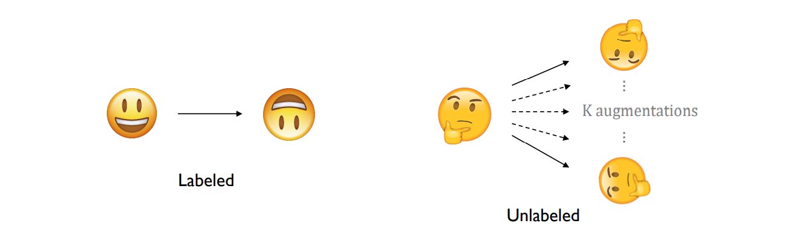
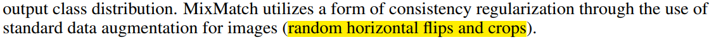
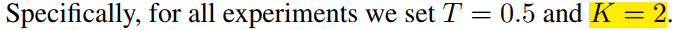
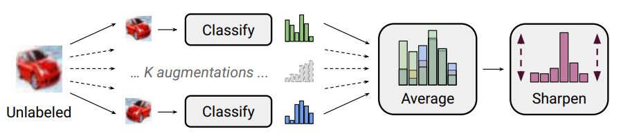
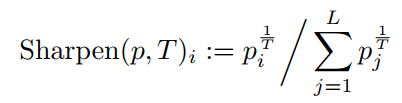
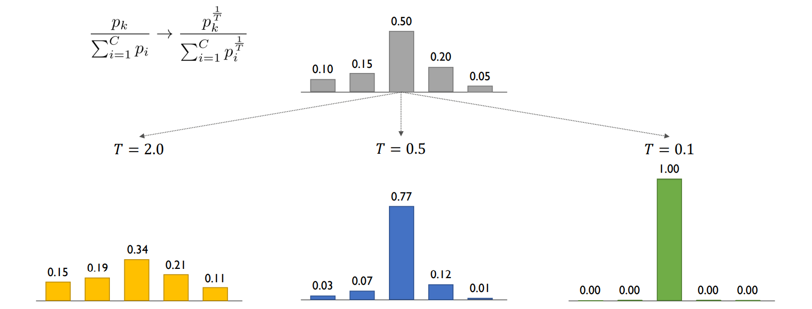
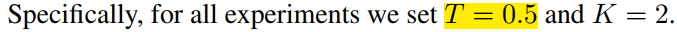
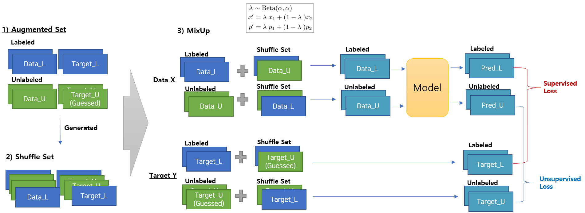
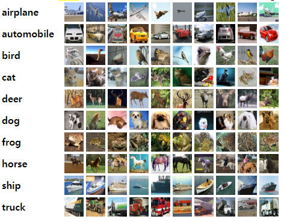

# 🤔MixMatch를 구현할 때 생각해봐야 하는 것들

## The things to consider for implementing MixMatch Algorithm


🔥이번 Tutorial에서는 **Semi-Supervised Learning Method** 중, **Holistic한 접근 방법인 MixMatch**를 구현해보면서, **구현 상에 고려해야 할 사항들**에 대해서 생각해 보는 시간을 갖으려고 한다. Github에 있는 여러가지 구현체들을 확인하였는데, 논문에는 드러나지 않은 사항들이 보이기에 이 Tutorial에서 여러가지 테스트와 함께 In-Depth하게 알아보고자 한다.

이는 사실 MixMatch 뿐만 아니라, Original MixMatch (from Google) 알고리즘에서 파생되어 나온 **FixMatch**에서도 동일한 구현상 고려해야 하는 사항이므로, 이번 Tutorial을 통해 잘 배워보는 시간을 갖도록 하자.

논문에서도 잘 다루지 않고, 구현체에서도 잘 설명이 없는 아래의 2가지 주제로 Tutorial을 전개하려 한다. 나머지 부분은 대부분 까다롭지 않다.

- MixMatch에서 **EMA(Exponential Moving Average)로 Teacher모델**을 만드는 것이 중요한가? 
- MixMatch에서 **Interleaving** 구현은 중요한가?


# Table of Contents

- [Background of MixMatch](#Background-of-MixMatch)

  - [1. Data Augmentation](#1-Data-Augmentation)
  - [2. Label Guessing and Label Sharpening](#2-Label-Guessing-&-Label-Sharpening)
  - [3. MixUp](#3-MixUp)

- [Tutorial. Deep Understanding of MixMatch Implementation](#Tutorial-Deep-Understanding-of-MixMatch-Implementation)

  - [1. Tutorial Notebook](#1-Tutorial-Notebook)
  - [2. Setting](#2-Setting)
  - [3. Usage Code](#3-Usage-Code)
  - [4. Result (Accuracy)](#4-Result_Accuracy)

- [Final Insights](#Final-Insights)

- [Conclusion](#Conclusion)

- [References](#References)

  

-------

# Background of MixMatch

## 1. Basic Concept

MixMatch는 기존의 Consistency Regularization과 Pseudo-Labeling과 같은 기법에서 벗어나서, 기존의 방법론들을 여러개를 결합하여 Holistic(전체론적)인 Approach로 접근한 최초의 논문이다. (from Google Research). 지금은 잘 모를수도 있으나, 처음 이 방식이 나왔을 때, 기존의 방법론들을 압도하는 Performance로 많은 이들에게 신선한 충격을 선사하였던 논문이다. 


**MixMatch에서 차용하고 있는 전체적인 방법론들은 아래와 같다.**

1. Data Augmentation 
2. Label Guessing & Label Sharpening
3. MixUp


위의 것들은 모두 과거의 논문들에서 많이 보아왔던 기법들인데, 이러한 **여러기법들을 조합하여 전체적인 Architecture 구조 형태로 좋은 성능**을 가져갔다는 것이, MixMatch 를 포함한 후속 Match시리즈 기법들의 특징이라고 볼 수 있다. 특히 Holistic하다고 하지만, MixMatch 같은 경우 특히나 구현과 구조가 매우 단순하면서도 좋은 성능을 가져왔기 때문에 선구자적인 논문 이라고 볼 수 있겠다.

이중 가장 중요한 것은 MixUp이며 이를 Shuffle구조를 가져가며 Data와 Label을 Matching해 주었기 때문에 MixMatch라고 부르지 않나 싶다.


> 🔥이제 알고리즘을 순서(Sequence)대로 알아보자..!


## 1) Data Augmentation

먼저 모든 Data의 Data Augmentation을 수행한다. 일반적으로 Computer Vision Deep Learning Model들이 그렇듯, **Regularization로써 Augmentation을 사용하여 일반화 성능을 향상**시킨다. 특히 나중에 있을 MixUp에서 더 다양한 조합으로 Labeled Data와 Unlabeled Data를 섞어서 학습할 수 있도록 만들어 준다.



위의 그림처럼 Labeled Data는 Batch별로 1회 Random Augmentation을, Unlabeled Data는 Batch별로 K회 Random Augmentation을 진행한다. 이때 논문에서 진행한 Augmentation은 아래와 같이 **Random horizontal flips와 Random Crops**이다.


> 


또한 논문에서는 Unlabeled Data에 대해서는 2회의 Augmentation을 진행하도록 Hyper-Parameter를 세팅하였다.

>  


## 2) Label Guessing & Label Sharpening

이 방식은 Pseudo Labeling과 동일한 방식이며, **Only Unlabeled Data에 대해서만 Label Guessing**을 수행한다. 또한 마찬가지로 Guessing된 **Unlabeled Data의 Label에 대해서만 Label Sharpening**을 진행한다. 전체적인 Flow는 아래와 같다. 

>  구현 시에 Augmented된 Label Data에 Guessing을 하는 것이 아님을 꼭 유의 해야 한다.




위와 같이 Batch별로 자동차를 K개의 Random Augmentation 한후, Guessing된 Label들을 Average하고, 그 값을 Sharpening한다. Sharpening이라는 것은 확률이 높은 것을 좀 더 강조(Temperature라는 Hyper-Parameter T를 사용하여, 얼마나 강조할지 조정한다.) 이 Label Sharpenig을 통해 Unlabeled Data의 Pseudo-Label에 대한 Entropy가 Minimization된다. (즉, 하나의 Guessing Label을 더 강조한다는 이야기임. 전체 Guessing Label이 Unifrom형태를 띈다면, Entropy가 Maximization이 된다.) 

> 특히 Entropy Minimization은 2005년 Semi-supervised learning by entropy minimization (Yves Grandvalet and Yoshua Bengio) 논문의 관찰을 통해 Idea를 얻었다고 저자들은 이야기 한다. 이는 그리고 High-Density Region Assumption을 더 강조하기 위함이다.





위와 같이 일반적인 Softmax의 확률값에 1/T 승을 하여 값을 결정하게 된다. T값이 2.0, 0.5, 0.1에 따라서, 값이 더 작을 수록 Winnner-Take-All을 하게 된다. 논문에서는 아래와 같이 Hyper-Parameter T값을 아래와 같이 0.5로 세팅 하였으며, 우리의 구현에서도 마찬가지로 0.5로 세팅 할 생각이다.

> 


## 3) MixUp

> MixMatch의 이름에 왜 Mix가 들어갔는지에 대한 이유이다. 그만큼 중요한 부분이다.

MixUp(2018, mixup: BEYOND EMPIRICAL RISK MINIMIZATION)에 나온 기법으로써, 원래는 좀 더 Decision Boundary를 Smooth하게 하여 Emperical Risk Minimization을 Supervised Learning에서 활용하기 위해 제안된 단순한 기법이다. 그러나 2019년 Interpolation consistency training for semi-supervised learning(ICT)에서 처음으로 이 방법을 Semi-Supervised Learning에 적용을 하였다. **MixUp을 통해서 좀 더 Smooth한 Boundary를 강제하는 Regularization**을 수행할 수 있다. 


>  Unlabeld Data에 대해서만 MixUp을 진행한 기존의 ICT 방식과 다르게, MixMatch는 Labeled Data와 Unlabeled Data모두에 MixUp을 수행한다. 


일종의 Data Agumentation과 유사한데, 위의 1)에서 Augmentation해서 생겨난 Data에 한번더 MixUp이라는 Augmentation을 진행하고, 그 X Data에 대한 예측과 Augmented된 Target Y값 사이의 오차를 줄이는 방식으로 학습한다. 상세하게는 아래의 그림과 같다.




- **1) Augmented Set을 준비한다.**
  - 위에서 진행한 Labeld Set의 Data에 1회 Augmentation
  - Unlabeld Set Data에 K회 Augmentation
- **2) Shuffle Set을 준비한다.**
  - Augmentation Set을 Copy하여 복사하고, Labeled Set과 UnLabeled Set을 모두 합쳐서 섞는다. 이때 Data X와 Target Y도 각각 섞어 준다.
- **3) MixUp을 진행한다.**
  - 1)과 2)에서 준비한 2개의 Set을 Beta 분포에서 뽑은 Lambda값을 통해서 Weighted Sum을 통해 Mixup한다. 이때 Lambda는 0.5~1사이의 값으로 주도록 하여, Shuffle Set보다 Augmented Set에 더 Weight를 주도록 한다. 그 이유는 각각의 Target_L(Labeled)과 Target_U(Unlabeled)에 대하여, Matching되도록 값을 주기 위함이다. (**아마 이 때문에 MixMatch라고 부르는게 아닌가 싶다.**) 그렇지 않는다면 Shuffle Set에 Bias되기 때문에 잘 Matching되도록 Lambda를 조절한다.
  - 그리고 MixUp된 Data_L(Labeled)과 Data_U(Unlabeled)에 대해서는 Model에 넣고, 각각의 예측 값인 Pred_L(Labeled)과 Pred_U(Unlabeled)를 뽑는다.
  - 그리고 Pred_L과 Target_L사이의 Loss를 Cross Entropy를 통해 Supervised Loss로 사용하고, Pred_U와 Target_U사이의 값은 Distance Metric(ex. MSE Loss)을 사용해 Unsupervised Loss를 구한다.
  - 그리고 2개의 Loss를 미리정해진 Hyper-Parameter값 Weight를 통해 조절한다. (그리고 이 값은 Learning Rate처럼, Ramp-Up을 통해 조절하도록 한다.)


----

# Tutorial. Deep Understanding of MixMatch Implementation

이번 튜토리얼에서는 전체적인 MixMatch를 Scratch로 구현해 보면서 알고리즘을 이해해 보려한다. 특히 원 저자들이 논문에서 제대로 건드리지 않았으나(혹은 반대로 이야기했으나!), 원저자들의 구현체 혹은 기타 다른 구현체들에서 이미 구현하고 있었으나 제대로 논의가 이루어지지 않은 영역에 대한 이해를 실험과 함께 가져가려 한다. 제기하고 싶은 의문은 2가지이다.

- MixMatch에서 **EMA(Exponential Moving Average)**로 Teacher모델을 만드는 것이 중요한가? 
- MixMatch에서 **Interleaving** 구현은 중요한가?

>  동시에 해당 논문에 대해서 Reviewer들이 이야기한 내용, 그리고 구현체들의 Issue에 제기한 의문들도 함께 보면서 이야기 해 보려 한다.


## 1. Tutorial Notebook 

### 🔥[Go to the tutorial notebook](https://github.com/Shun-Ryu/business_analytics_tutorial/blob/main/4_ensemble/Tutorials/Tutorial_Ensemble_Learning_On_Imbalacned_Regression.ipynb)


## 2. Setting

### Datasets

데이터는 유명한 CIFAR-10을 사용하도록 한다. 10개의 Class를 갖고 있는 32x32x3 Shape의 Imageset이다.



|      | Datasets                  | Description                               | Num Instances                                   | Image Size | Num Channels | Single Output Classes |
| ---- | ------------------------- | ----------------------------------------- | ----------------------------------------------- | ---------- | ------------ | --------------------- |
| 1    | CIFAR-10 (Classification) | 10개의 Class를 가진 작은 이미지 데이터 셋 | Training Set : 50,000<br />Testing Set : 10,000 | 32 x 32    | 3            | 10                    |

데이터셋은 아래와 같은 코드로 불러오게 된다.

```python
# dataset_name = 'diabetes'
dataset_name = 'california_house'
# dataset_name = 'boston_house'

if dataset_name == 'diabetes':
    x, y= datasets.load_diabetes(return_X_y=True)
    threshold_rare = 270
    EPOCHS = 3500
    TRAIN_BATCH = 2048
elif dataset_name == 'california_house':
    data = datasets.fetch_california_housing()
    x = data.data
    y = data.target
    threshold_rare = 3.5
    EPOCHS = 800
    TRAIN_BATCH = 4096 
elif dataset_name == 'boston_house':
    data_url = "http://lib.stat.cmu.edu/datasets/boston"
    raw_df = pd.read_csv(data_url, sep="\s+", skiprows=22, header=None)
    x = np.hstack([raw_df.values[::2, :], raw_df.values[1::2, :2]])
    y = raw_df.values[1::2, 2]

    threshold_rare = 35
    EPOCHS = 3500
    TRAIN_BATCH = 2048


```

불러진 3개의 Dataset에 대한 Y값의 Sampling 분포는 아래와 같다. 특별히 Imbalanced Dataset을 고른 것도 아니지만. 모든 데이터가 왼쪽으로 Skew가 된, Right-Side Long-tailed Regression Problem이라는 것을 알 수 있다.


각 Regression Task에서 Imbalanced Regression의 정확도를 구하기 위하여, Many shot과 Few Shot으로 데이터셋을 나누어 계산하려 한다. 따라서 아래와 같은 Threshold값을 통해 데이터를 2가지 형태로 구분하고, 각각의 구분된 Many shot과 Few shot의 정확도를 L1 Loss로 구하게 된다.

- **Diabetes : 270** 
- **Boston House Price : 35**
- **California House Price : 3.5**

이러한 수치를 구하는 것을 SMOTE, SMOGN 등의 기법들을 구현하 저자들은 Relevance Function을 구하여 정하게 되는데, 사실 특별한 차이는 없기 떄문에, 간단히 Constant Threshold로 Many Shot과 Few Shot으로 구분 하였다. 최근의 Imbalanced Regression Task 논문들에서도 위와 유사하게 진행한다.


### Algorithms

우리는 MixMatch 1가지만 집중적으로 파 보고자 한다. 특히 위에서 제기한 2가지, EMA 방식의 Teacher Network와 Interleave에 대한 이해를 파보겠다.

| Algorithm | Target         | Description                                                  |
| --------- | -------------- | ------------------------------------------------------------ |
| MixMatch  | Classification | WideResNet을 Backbone으로 사용한 Holistic Semi-Supervised Learning |


## 3. Implementation of MixMatch

### MLP

2개의 Hidden Layer와 Input, Output Layer를 가진 간단한 MLP구조를 Main Model로 사용하였다. 기본적으로 Dropout과 Batchnormalization 등의 기법을 사용하여 Regularization을 하였으며, Overfitting전에 Validation Set으로 결정된 Best Model을 중간중간 저장하기 때문에 사실 해당 MLP모델은 Variance Error를 많이 줄여둔 상태라고도 볼 수 있다. 특히나 Dropout같은 경우 0.5 정도로 크게 걸어주었기 때문에, Dropout이 Ensemble과 유사한 효과를 낼 수 있이므로, 한번 이 상태에서 Ensemble의 효과가 과연 추가적으로 있을지 보도록 하자.


> Model Code

```python
BATCH_SIZE = 2048 
LEARNING_RATE = 0.001

NUM_INPUT = x_train.shape[1]
NUM_OUTPUT = 1 
NUM_1ST_HIDDEN = 32 
NUM_2ND_HIDDEN = 16 
NUM_1ST_DROPOUT = 0.6
NUM_2ND_DROPOUT = 0.5

class BasicRegressor(nn.Module):
    def __init__(self) -> None:
        super(BasicRegressor, self).__init__()

        self.layer_1 = nn.Linear(NUM_INPUT, NUM_1ST_HIDDEN)
        self.layer_2 = nn.Linear(NUM_1ST_HIDDEN, NUM_2ND_HIDDEN)
        self.layer_out = nn.Linear(NUM_2ND_HIDDEN, NUM_OUTPUT)

        # self.actvation = nn.ReLU()
        self.actvation_1 = nn.ReLU()
        self.actvation_2 = nn.ReLU()
        self.dropout_1 = nn.Dropout(p=NUM_1ST_DROPOUT)
        self.dropout_2 = nn.Dropout(p=NUM_2ND_DROPOUT)
        self.batchnorm_1 = nn.BatchNorm1d(NUM_1ST_HIDDEN)
        self.batchnorm_2 = nn.BatchNorm1d(NUM_2ND_HIDDEN)
    
    def forward(self, inputs):
        x = self.actvation_1(self.layer_1(inputs))
        x = self.batchnorm_1(x)
        x = self.dropout_1(x)
        x = self.actvation_2(self.layer_2(x))
        x = self.batchnorm_2(x)
        x = self.dropout_2(x)
        x = self.layer_out(x)

        return x

device = torch.device("cuda:0" if torch.cuda.is_available() else "cpu")
print(device)

```


> Training Code

학습은 굉장히 단순하다. 하나의 모델을 학습을 진행하면 끝난다. :) 

```python
num_train_data = len(train_loader)
num_eval_data = len(valid_loader)


elapsed_time_basic_ann = []

start_time = datetime.now()


best_model = train_model(num_train_data, num_eval_data)


elapsed_time_basic_ann.append((datetime.now()-start_time).total_seconds())
```


> Inference Code

Inference도 굉장히 단순하다. 저장된 Best Model 1개로 Test Dataset에 대해 Evaluation하고, 그에 대한 개별 Loss를 구한다. (Few Shot과 Many Shot에 대한 개별적 L1 Loss를 계산함)

```python
best_model.eval()
data = torch.from_numpy(x_test).float().to(device)
answer = torch.from_numpy(y_test).float().to(device)

start_time = datetime.now()
output = best_model(data)
loss_basic_ann = calc_loss(output, answer)
elapsed_time_basic_ann.append((datetime.now()-start_time).total_seconds())

print('elapsed time ', elapsed_time_basic_ann)
```


## 4. Result_Accuracy

- 측정 단위 : MAE (Mean Absolute Error)
- Dataset은 Testset 20%, Training 64%, Validation 16%를 기준으로 진행하였다.
- Accuracy는 Testset에 대해서만 계산하였다. (당연히!)
- 모델은 Validation 기준으로 Loss가 가장 적은 Best Model로 Testing을 진행함
- 3개의 Dataset에 대한 각각의 Loss는 3가지로 구분된다.
  - 전체의 Average(Avg)
  - Normal Distribution(Many Shot)
  - Rare Distribution(Few Shot)


|      | Algorithm                     | Diabetes (Avg) | Diabetes (Many Shot) | Diabetes (Few Shot) | Boston House (Avg) | Boston House (Many Shot) | Boston House (Few Shot) | California House (Avg) | California House (Many Shot) | California House (Few Shot) |
| ---- | ----------------------------- | -------------- | -------------------- | ------------------- | ------------------ | ------------------------ | ----------------------- | ---------------------- | ---------------------------- | --------------------------- |
| 1    | MLP                           | 46.90          | 39.84                | 92.18               | 2.60               | 2.07                     | 8.09                    | 0.44                   | **0.36**                     | 1.00                        |
| 2    | Ensemble MLP (x3)             | **43.24**      | **36.47**            | **86.55**           | **2.41**           | 1.99                     | **6.71**                | 0.44                   | 0.37                         | **0.93**                    |
| 3    | Ensemble MLP with REBAGG (x3) | 44.35          | 37.38                | 89.11               | 2.59               | 2.10                     | 7.64                    | 0.44                   | **0.36**                     | 1.00                        |
| 4    | Ensemble MLP (x6)             | 43.88          | 36.60                | 90.60               | 2.50               | 2.06                     | 7.07                    | 0.44                   | 0.37                         | 0.94                        |
| 5    | Ensemble MLP with REBAGG (x6) | 44.70          | 37.66                | 89.92               | 2.42               | **1.96**                 | 7.11                    | 0.44                   | 0.37                         | 0.95                        |


----


# Final Insights

- Accuracy 결과를 보면 Complexity가 높은 MLP와 같은 딥러닝 모델 상황에서는 Bagging을 사용하면 거의 대부분 성능이 향상됨을 알 수 있었다.
- 특히나 단순히 Ensemble(x3, x6 모두)을 사용했음에도, Average Accuracy뿐만 아니라, Many Shot에서도 Few Shot에서도 모두 성능이 향상됨을 볼 수 있었다.
- 즉, Imbalanced Regression Task환경에서도 단순 Ensemble로 성능 향상을 가져올 수 있음을 알 수 있다. Ensemble이 Imbalanced Classification에서는 몇가지 논문이 나왔으나, 아직 Imbalanced Regression에는 거의 논문이 없는 것을 보아서는 이 분야에 대해서 좀 더 In-Depth있는 연구를 통해 연구 성과를 만들 수 있지 않을까 기대해 볼 수 있겠다.
- 그나마 Imbalanced Regression Task에 존재하는 REBAGG과 같은 방법론을 이번 Tutorial에서 테스트를 해 보았으나, 오히려 전반적으로 Few-Shot에서 단순 Ensemble이 더 좋은 결과를 내는 것을 볼 수 있었다. 개인적으로 SMOTE, SMOGN같은 계열을 전혀 선호하지 않는데, 여러 Classification, Regression Task의 Project들을 진행해봤을때 거의 성능의 상승 효과가 Random Oversampling보다도, 그리고 단순한 Loss Re-Weighting보다도 더 좋은 결과를 나타내지 않았기 때문이다. 거기다가 Training Time만 늘리기 때문에 사실 SMOTE 계열은 나는 거의 사용하지 않는다. REBAGG의 방법론도 SMOTE for Regression를 만든 연구실에서 나온 방법론이데, 역시나 성능의 향상이 거의 없다고 생각이 든다. 다른 연구원분들도 과제 하실때 많이 참고하셨으면 좋겠다.
- 그리고 Ensemble을 더 많은 모델 수로 늘렸을때 성능이 더 향상될 줄 예상하였으나, 예상과 달리 3개(x3)썼을 때가 6개(x6)를 Ensemble 하였을 때 보다 모두 성능이 좋았다. 이를 통해서 Bagging을 통한 Ensemble시에 적절한 Ensemble 개수의 선택이 중요하다는 것을 알 수 있었다.
- 재미있는 사실은 Dataset에 따라서 이 Ensemble의 적절한 수가 다를 것 같다고 생각이 들었지만, 이번에 Tutorial에서 활용한 3개의 Dataset 모두 3개의 Ensemble에서 모두 6개의 Ensemble보다 좋은 것을 보아서는 Ensemble이 Dataset에 Dependecy가 있을지도 모르지만 일단 결과적으로는 Dataset에 대한 Dependency는 오히려 없어 보이는게 신기하였다.
- 따라서 Test를 통하여 Ensemble 개수의 최적점을 찾는 Case를 Future Work로 시도해볼 가치가 있을 것 같다.


# Conclusion

결론적으로, Ensemble은 Imbalanced Data(여기서는 Imbalanced Regression)에 효과가 있다.


-----

# References

-  고려대학교 산업경영공학부 강필성 교수님 Business Analytics 강의 자료
- https://hipolarbear.tistory.com/19
